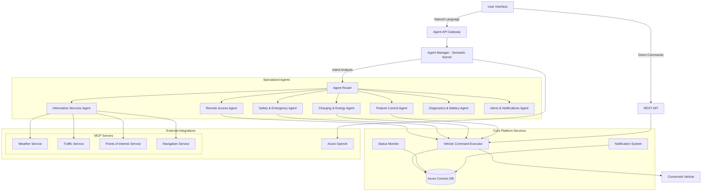
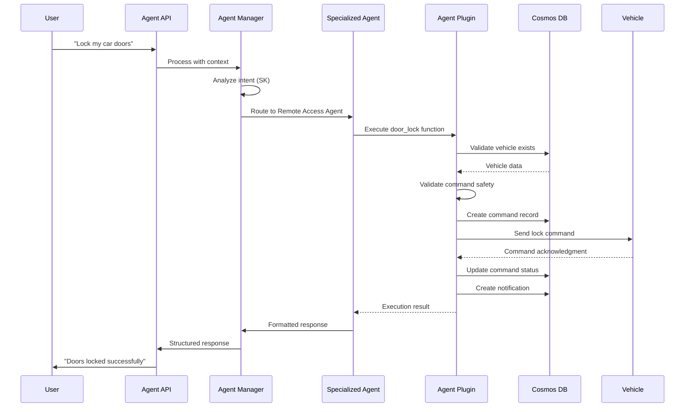

# Agentic Connected Vehicle Platform

An intelligent vehicle management platform where specialized AI agents handle different aspects of vehicle operations and user interactions through natural language processing. Built with FastAPI, Semantic Kernel, React.js, and Azure Cloud Services.

## Project Details
- **Features**  
  Natural-language agent interface; Remote access (lock/unlock, engine start/stop); EV charging & energy optimization; Weather, traffic & POI info; In-car controls (climate, lights, windows); Diagnostics & predictive maintenance; Alerts & notifications.
- **Tech Stack**  
  Python 3.12+, FastAPI, Semantic Kernel, Azure Cosmos DB (AAD auth), Azure OpenAI, React.js, Material-UI.
- **Deployment**  
  Azure App Service, Azure Cosmos DB, Azure OpenAI Service, AAD authentication.

Notes:
- MCP services use plugin/sample_data.py (no external keys needed by default).

## Naming & Serialization
- API + stored JSON: camelCase (enforced by CamelModel).
- Python internals: snake_case.
- Never manually transform keys—return model instances.

## Dev Test Data Seeding

Use the built-in dev seed endpoints to create sample data for local development.

```bash
# Default seed
curl -X POST http://localhost:8000/api/dev/seed

# Seed a specific vehicleId
curl -X POST "http://localhost:8000/api/dev/seed?vehicleId=a640f210-dca4-4db7-931a-9f119bbe54e0"

# Bulk seed (camelCase keys)
curl -X POST http://localhost:8000/api/dev/seed/bulk \
  -H "Content-Type: application/json" \
  -d '{
    "vehicles": 5,
    "commandsPerVehicle": 2,
    "notificationsPerVehicle": 2,
    "servicesPerVehicle": 1,
    "statusesPerVehicle": 1
  }'

# Check last seed status
curl http://localhost:8000/api/dev/seed/status
```

Note: The legacy local JSON generator (vehicle/tests/generator/* and vehicle/tests/generate_sample_data.py) is deprecated and removed.

## System Overview

### Core Architecture

The platform implements a sophisticated multi-agent system that provides two primary interaction modes:

1. **Direct API Operations** - Traditional REST API endpoints for vehicle management, command execution, and data retrieval
2. **Agentic Interface** - Natural language interactions with specialized agents that interpret user intent and perform contextual actions

### Key Components

- **Agent Manager** - Central orchestrator using Semantic Kernel for intent interpretation and agent coordination
 - **Agent Manager** - Central orchestrator using Semantic Kernel for intent interpretation, agent routing, and optional Server-Sent Events (SSE) streaming responses
- **Specialized Agents** - Domain-specific agents for vehicle operations (7 specialized agents)
- **Vehicle Management** - Comprehensive vehicle profiles, status monitoring, and service records
- **Command Execution** - Asynchronous vehicle control operations with real-time status tracking
- **Azure Integration** - Cosmos DB for persistence, Azure OpenAI for intelligence
- **MCP Integration** – Model Context Protocol servers for weather, traffic, points of interest, and navigation using deterministic sample data centralized in plugin/sample_data.py (easy to swap to real APIs later)
- **Car Simulator** - Advanced vehicle behavior simulation for testing and development

## Specialized Agent System

The platform features a purpose-driven agent architecture where each agent specializes in specific vehicle domains:

### 🚗 **Remote Access Agent**
Controls vehicle access and remote operations:
- **Door Control** - Lock/unlock individual or all doors with safety validations
- **Engine Control** - Remote start/stop with proper safety checks
- **Horn & Lights** - Vehicle location assistance
- **Command Validation** - Ensures safe command execution

### 🚨 **Safety & Emergency Agent**
Handles critical safety situations and emergency response:
- **Emergency Calls** - Automatic eCall initiation with precise location data
- **Collision Detection** - Real-time collision alert processing and emergency dispatch
- **Theft Protection** - Vehicle theft reporting with location tracking
- **SOS Requests** - Manual emergency assistance with priority handling

### ⚡ **Charging & Energy Agent**
Manages electric vehicle charging and energy optimization:
- **Charging Stations** - Find nearby stations with real-time availability and pricing
- **Charging Control** - Start/stop charging sessions with safety monitoring
- **Energy Analytics** - Usage tracking, efficiency analysis, regenerative braking data
- **Range Estimation** - Dynamic range calculation based on driving conditions and battery health

### 📍 **Information Services Agent**
Provides real-time contextual information and navigation:
- **Weather Services** - Current conditions and forecasts via MCP integration
- **Traffic Information** - Real-time traffic conditions, incidents, and route optimization
- **Points of Interest** - Nearby restaurants, services, fuel stations, and attractions
- **Navigation** - Route planning with real-time updates

### 🎛️ **Vehicle Feature Control Agent**
Manages in-car comfort and convenience features:
- **Climate Control** - Temperature, fan speed, A/C, and heating with smart presets
- **Lighting Control** - Headlights, interior lights, and hazard lights
- **Window Control** - Individual or group window operation
- **Seat Management** - Seat heating, positioning, and memory settings

### 🔧 **Diagnostics & Battery Agent**
Monitors vehicle health and predictive maintenance:
- **System Diagnostics** - Comprehensive ECU monitoring and error code analysis
- **Battery Health** - Voltage monitoring, capacity analysis, and replacement scheduling
- **Predictive Maintenance** - AI-driven service interval recommendations
- **Performance Analytics** - Engine efficiency, fuel consumption, and wear patterns

### 🔔 **Alerts & Notifications Agent**
Manages proactive monitoring and user preferences:
- **Speed Alerts** - Configurable speed limit notifications with customizable thresholds
- **Curfew Monitoring** - Time-based vehicle usage alerts for fleet management
- **Battery Warnings** - Intelligent low battery and charging reminders
- **Maintenance Alerts** - Proactive service scheduling and parts replacement notifications

## System Architecture

### Multi-Agent Communication Flow



### Agent Processing Workflow



## API Specifications

### Agent System APIs (`/api/agent/*`)
- `POST /api/agent/ask` – Universal natural language interface (set `stream:true` for SSE streaming). Context prefers camelCase keys (e.g., `vehicleId`, `agentType`); snake_case is accepted but normalized internally.
- `POST /api/agent/remote-access` – Remote access intents (lock/unlock, engine start/stop, locate)
- `POST /api/agent/safety-emergency` – Emergency, collision, theft, SOS intents
- `POST /api/agent/charging-energy` – Charging operations & energy insights
- `POST /api/agent/information-services` – Weather / traffic / POI / navigation (MCP-backed)
- `POST /api/agent/feature-control` – Climate, windows, lights, seat comfort
- `POST /api/agent/diagnostics-battery` – Diagnostics & battery health analysis
- `POST /api/agent/alerts-notifications` – Alert rule + notification interactions

### Agent Analytics / Recommendations
- `POST /api/agent/analyze/vehicle-data` – Diagnostics analysis (uses Diagnostics & Battery agent)
- `POST /api/agent/recommend/services` – Service recommendation generation (currently handled via Feature Control agent pipeline)

### Direct Vehicle Control / Feature / Emergency Routers
Explicit REST-style endpoints (bypass NL intent) for structured apps. All accept query parameter `direct_api_call=true|false` (default `true`). When `false`, request is routed through the AgentManager instead of directly invoking the domain plugin.
- `POST /api/vehicles/{vehicle_id}/remote-access/doors` – Body: `{ "action": "lock|unlock" }`
- `POST /api/vehicles/{vehicle_id}/remote-access/engine` – Body: `{ "action": "start|stop" }`
- `POST /api/vehicles/{vehicle_id}/remote-access/locate` – Activate horn & lights
- `POST /api/vehicles/{vehicle_id}/emergency/call` – Initiate emergency call (`emergency_type` optional)
- `POST /api/vehicles/{vehicle_id}/emergency/collision` – Report collision (`severity`, optional location)
- `POST /api/vehicles/{vehicle_id}/emergency/theft` – Report theft
- `POST /api/vehicles/{vehicle_id}/emergency/sos` – Immediate SOS
- `POST /api/vehicles/{vehicle_id}/features/lights` – Control lights (`light_type`, `action`)
- `POST /api/vehicles/{vehicle_id}/features/climate` – Climate / temperature control
- `POST /api/vehicles/{vehicle_id}/features/windows` – Window control (`action`, `windows`)
- `GET  /api/vehicles/{vehicle_id}/features/status` – Aggregated feature status (direct plugin or via agent depending on `direct_api_call`)

### Core Platform & Data APIs
- `GET    /api/vehicles` – List vehicle profiles
- `POST   /api/vehicle` – Create vehicle profile (requires `vehicleId` field; `id` optional legacy)
- `GET    /api/vehicles/{vehicle_id}` – Retrieve vehicle profile
- `GET    /api/vehicles/{vehicle_id}/status` – Latest status snapshot
- `GET    /api/vehicle/{vehicle_id}/status/stream` – Status SSE stream (note singular `vehicle` in path)
- `PUT    /api/vehicle/{vehicle_id}/status` – Full status replace (body must include matching `vehicleId`)
- `PATCH  /api/vehicle/{vehicle_id}/status` – Partial status update
- `POST   /api/vehicles/{vehicle_id}/services` – Add service record
- `GET    /api/vehicles/{vehicle_id}/services` – List service records
- `PUT    /api/vehicles/{vehicle_id}/services/{serviceId}` – Update service
- `DELETE /api/vehicles/{vehicle_id}/services/{serviceId}` – Delete service
- `GET    /api/vehicles/{vehicle_id}/command-history` – Summary history of commands
- `POST   /api/command` – Submit command (async processing & notification)
- `GET    /api/commands` – List commands (optional `vehicleId` query)
- `GET    /api/notifications` – List notifications (optional `vehicleId` query)
- `POST   /api/notifications` – Create notification
- `PUT    /api/notifications/{notification_id}/read` – Mark read
- `DELETE /api/notifications/{notification_id}` – Delete notification
- `GET    /api/notifications/stream?vehicle_id=...` – SSE stream of new notifications (poll-based)

### Speech & Voice / Avatar
- `GET /api/speech/token` – Azure Speech auth token (cached ~9 min)
- `GET /api/speech/ice_token` – ICE relay token for avatar streaming
- `POST /api/speech/ask_ai` – Lightweight direct LLM response (short TTS-safe answer)

### Development Seeding (non-prod)
- `POST /api/dev/seed` – Seed single vehicle (optional `?vehicleId=`)
- `POST /api/dev/seed/bulk` – Bulk seed with counts (camelCase body)
- `GET  /api/dev/seed/status` – Last bulk seed summary

### Health & Info
- `GET /api/info` – Service status + version + Cosmos availability
- `GET /api/health` – Detailed health (Cosmos + MCP sidecars weather/traffic/poi/navigation)
- `GET /api/debug/cosmos` – Cosmos client diagnostics (development)
- `POST /api/mcp/restart` – Restart MCP sidecars (when `ENABLE_MCP=true`)

```bash
# List vehicles
curl http://localhost:8000/api/vehicles

# Create a vehicle (vehicleId required)
curl -X POST http://localhost:8000/api/vehicle \
  -H "Content-Type: application/json" \
  -d '{
    "vehicleId": "vehicle-123",
    "make": "Tesla",
    "model": "Model 3",
    "year": 2024,
    "status": "Active"
  }'

# Fetch status snapshot
curl http://localhost:8000/api/vehicles/vehicle-123/status

# Stream live status (SSE)
curl -N http://localhost:8000/api/vehicle/vehicle-123/status/stream

# Replace status (include vehicleId)
curl -X PUT http://localhost:8000/api/vehicle/vehicle-123/status \
  -H "Content-Type: application/json" \
  -d '{
    "vehicleId": "vehicle-123",
    "battery": 83,
    "temperature": 35,
    "speed": 0
  }'

# Partial status patch
curl -X PATCH http://localhost:8000/api/vehicle/vehicle-123/status \
  -H "Content-Type: application/json" \
  -d '{ "battery": 79 }'

# Submit a command
curl -X POST http://localhost:8000/api/command \
  -H "Content-Type: application/json" \
  -d '{
    "vehicleId": "vehicle-123",
    "commandType": "LOCK_DOORS",
    "parameters": { "doors": "all" }
  }'

# Direct remote door lock
curl -X POST http://localhost:8000/api/vehicles/vehicle-123/remote-access/doors \
  -H "Content-Type: application/json" \
  -d '{"action": "lock"}'

# Analyze vehicle data (agent)
curl -X POST http://localhost:8000/api/agent/analyze/vehicle-data \
  -H "Content-Type: application/json" \
  -d '{"vehicleId": "vehicle-123", "timePeriod": "30d", "metrics": ["battery","speed"]}'

# Service recommendations
curl -X POST http://localhost:8000/api/agent/recommend/services \
  -H "Content-Type: application/json" \
  -d '{"vehicleId": "vehicle-123", "mileage": 42000, "lastServiceDate": "2024-05-01"}'

# Seed dev data (single)
curl -X POST http://localhost:8000/api/dev/seed?vehicleId=vehicle-123
```

### Field & Casing Notes
All Pydantic models inherit from `CamelModel`:
- Accept snake_case or camelCase inbound
- Always emit camelCase JSON

Key fields:
- VehicleProfile: `vehicleId` (primary) — always include when creating.
- Command: `commandId` (server-assigned), `commandType`, `vehicleId`, `status` (life-cycle: pending → processing → completed).
- VehicleStatus: includes `vehicleId` + server `timestamp`.
- Notification: `id`, `vehicleId`, `type`, `severity`, `read`.

Agent context best practice: prefer camelCase keys (`vehicleId`, `sessionId`, `agentType`).

### Streaming Conventions
- Agent streaming (`stream:true`): SSE frames `data: {json}\n\n` accumulating `response` text; final frame sets `complete:true`. Fields: `response`, `complete`, `sessionId`, optional `pluginsUsed`, `error`.
- Status streaming: raw status documents per frame (includes `timestamp`).
- Notification streaming: each new notification as an SSE frame (oldest-first within each poll batch).

### Versioning
`/api/info` reports the current backend version (presently `2.0.0`).

## API Authentication (Azure AD / JWT)

The backend validates Microsoft Entra ID (Azure AD) access tokens.

### Single App Registration Configuration

You can use a single app registration for both the SPA frontend and API backend. Here's how to configure it:

#### Step 1: Create or Configure App Registration
1. Go to Azure Portal > Azure Entra ID > App registrations
2. Create new registration or select existing (e.g., <your-app-client-id>)
3. Name: `agentic-cvp-app` (or your preferred name)
4. Supported account types: Single tenant (or multi-tenant if needed)

#### Step 2: Configure Authentication Platforms
1. Navigate to **Authentication** in your app registration
2. Add platform > **Single-page application**:
   - Redirect URI: `http://localhost:3000` (for development)
   - For production, add: `https://your-domain.com`
3. Under **Implicit grant and hybrid flows**:
   - Check: ✓ Access tokens, ✓ ID tokens

#### Step 3: Expose an API
1. Navigate to **Expose an API**
2. Set Application ID URI: `api://<your-app-client-id>`
   - Click "Set" and accept the default or customize
3. Add a scope:
   - Scope name: `access_as_user`
   - Who can consent: `Admins and users`
   - Admin consent display name: `Access Connected Vehicle Platform API`
   - Admin consent description: `Allows the app to access the Connected Vehicle Platform API on behalf of the signed-in user`
   - User consent display name: `Access your vehicle data`
   - User consent description: `Allow the application to access your vehicle data on your behalf`
   - State: `Enabled`

#### Step 4: Grant API Permissions to Itself (Critical)
1. Navigate to **API permissions**
2. Click **Add a permission**
3. Choose **My APIs** tab
4. Select your app (<your-app-client-id>)
5. Select **Delegated permissions**
6. Check: ✓ `access_as_user`
7. Click **Add permissions**

#### Step 5: Configure Environment Variables

Backend Configuration (vehicle/.env):
```env
AZURE_TENANT_ID=<your-tenant-id>
AZURE_CLIENT_ID=api://<your-app-client-id>   # Application ID URI (audience)
AZURE_AUTH_REQUIRED=true
```

Frontend Configuration (web/.env):
```env
REACT_APP_AZURE_CLIENT_ID=<your-app-client-id>   # Same app GUID (not api://)
REACT_APP_AZURE_TENANT_ID=<your-tenant-id>
REACT_APP_AZURE_SCOPE=api://<your-app-client-id>/access_as_user
```

#### Step 6: Verify Configuration
1. Clear browser cache and cookies
2. Restart both backend and frontend servers
3. Sign in to the application
4. Check token in browser console:

Validation steps:
1. SPA acquires token with the scope above.
2. Token aud (inspect via https://jwt.ms) should be api://<your-app-client-id>.
3. Backend accepts and attaches claims to request.state.user.

## Getting Started

### Prerequisites

- **Python 3.12+** with pip
- **Node.js 16+** with npm
- **Azure Subscription** for cloud services
- **Azure CLI** for authentication and resource management

### Quick Start with Azure

1. **Create Azure Resources**
   ```bash
   # Login to Azure
   az login
   
   # Create resource group
   az group create --name rg-connected-car --location eastus
   ```

2. **Configure Authentication**
   ```bash
   # Set up Azure AD authentication for Cosmos DB
   az login --tenant <your-tenant-id>

   # Dev: Get a user principal ID in Entra ID
   # Prod: Get a principal ID for the App Service
   PRINCIPAL_ID=$(az ad signed-in-user show --query id -o tsv)
   SUBSCRIPTION_ID=$(az account show --query id -o tsv)
   
   az cosmosdb sql role assignment create \
     --resource-group rg-connected-car \
     --account-name cosmos-connected-car \
     --role-definition-id 00000000-0000-0000-0000-000000000002 \
     --principal-id $PRINCIPAL_ID \
     --scope "/"
   ```

3. **Backend Setup**
    ```bash
    cd vehicle
    poetry install
    # Copy example env files and edit values before running
    cp .env.sample .env
    # Run tests (optional)
    poetry run pytest
    # Run the server
    python main.py
    ```

4. **Frontend Setup**
   ```bash
   cd web
   # Copy example env files and edit values before running
   cp .env.example .env.development
   cp .env.example .env.production

   # Install yarn
   npm install -g yarn
   
   # Install dependencies
   yarn install
   
   # Start development server
   yarn start
   ```

5. **Access the Platform**
   - **Backend API**: http://localhost:8000
   - **Frontend UI**: http://localhost:3000
   - **API Documentation**: http://localhost:8000/docs

### Manual Configuration

If you prefer manual setup, create a `.env` file in the `vehicle/` directory:

```env
# Azure Cosmos DB
COSMOS_DB_ENDPOINT=https://<your-cosmos-account>.documents.azure.com:443/
COSMOS_DB_KEY=<your_cosmos_key_or_use_aad>
COSMOS_DB_USE_AAD=true
COSMOS_DB_DATABASE=VehiclePlatformDB

# Azure OpenAI
AZURE_OPENAI_ENDPOINT=https://<your-openai>.openai.azure.com/
AZURE_OPENAI_API_KEY=<your_openai_key>
AZURE_OPENAI_DEPLOYMENT_NAME=
AZURE_OPENAI_API_VERSION=

# Public OpenAI (optional fallback)
OPENAI_API_KEY=
OPENAI_CHAT_MODEL_NAME=

# Application Settings
LOG_LEVEL=INFO
API_HOST=0.0.0.0
API_PORT=8000
```

Notes:
- MCP servers (weather/traffic/poi/navigation) use plugin/sample_data.py and do not require external API keys by default.
- Cosmos DB is required; configure AAD or key as above.

## Frontend Authentication (Microsoft Entra ID)
Add a `.env` inside `web/` (do not commit secrets):

```
REACT_APP_AZURE_CLIENT_ID=<app-registration-client-id>
REACT_APP_AZURE_TENANT_ID=<directory-tenant-id>
# Optional explicit redirect (defaults to window.origin)
REACT_APP_AZURE_REDIRECT_URI=http://localhost:3000
```

After setting variables:
1. First load will redirect to Microsoft sign-in
2. Tokens injected automatically for API calls when scope configured

- [Tutorial: Create a React single-page application and prepare it for authentication](https://learn.microsoft.com/en-us/entra/identity-platform/tutorial-single-page-app-react-prepare-app?tabs=workforce-tenant)

## Advanced Features

### Real-time Agent Streaming
Enable streaming responses for natural conversations:

```javascript
const response = await fetch('/api/agent/ask', {
  method: 'POST',
  headers: { 'Content-Type': 'application/json' },
  body: JSON.stringify({
    query: "Prepare my car for a long trip",
  context: { vehicleId: "my-car" },
    stream: true
  })
});

const reader = response.body.getReader();
// Process streaming chunks...
```

### Custom Agent Development
Extend the platform with custom agents:

```python
from semantic_kernel.functions import kernel_function
from typing import Dict, Any, Optional

class MyCustomPlugin:
    @kernel_function(description="Custom vehicle operation")
    async def my_custom_function(self, vehicle_id: str) -> Dict[str, Any]:
        # Implement custom logic
        return {"message": "Custom operation completed", "success": True}
```

## Production Deployment

### Azure App Service Deployment
```bash
# Create App Service plan
az appservice plan create --resource-group rg-connected-car --name plan-connected-car --sku B1 --is-linux

# Create web app
az webapp create --resource-group rg-connected-car --plan plan-connected-car --name app-connected-car --runtime "PYTHON|3.12"

# Deploy application
az webapp up --name app-connected-car --resource-group rg-connected-car
```

### Security Configuration
```python
# Production CORS settings
app.add_middleware(
    CORSMiddleware,
    allow_origins=["https://your-domain.com"],
    allow_credentials=True,
    allow_methods=["GET", "POST", "PUT", "DELETE"],
    allow_headers=["*"],
)

# Enable Azure Key Vault for secrets
from azure.keyvault.secrets import SecretClient
```

## Monitoring & Observability

### Structured Logging
```python
from utils.logging_config import get_logger
logger = get_logger(__name__)
```

### Health Checks
- `GET /api/health` - Application health status
- `GET /api/` - Detailed service status including Azure connectivity

## Troubleshooting

### Common Issues

1. **Azure Authentication Errors**
   ```bash
   # Verify Azure login
   az account show
   
   # Check Cosmos DB permissions
   az cosmosdb sql role assignment list --resource-group rg-connected-car --account-name cosmos-connected-car
   ```

2. **Agent Response Issues**
   - Verify Azure OpenAI deployment name and endpoint
   - Check Semantic Kernel plugin registration in agent initialization
   - Review structured logs for detailed error information

3. **Cosmos DB Connection Issues**
(Use ensured client + await ensure_connected before queries.)
```python
# Minimal connectivity test
import asyncio
from vehicle.azure.cosmos_db import get_cosmos_client
async def main():
    client = await get_cosmos_client()
    await client.ensure_connected()
asyncio.run(main())
print("Cosmos connected")
```

4. **MCP Service Issues**
   - Ensure MCP servers are running on the correct ports:
     - Weather: 8001
     - Traffic: 8002
     - Points of Interest: 8003
     - Navigation: 8004
   - Check firewall settings for external API access
   - Verify plugin configuration in Information Services Agent

## License

This project is licensed under the MIT License.