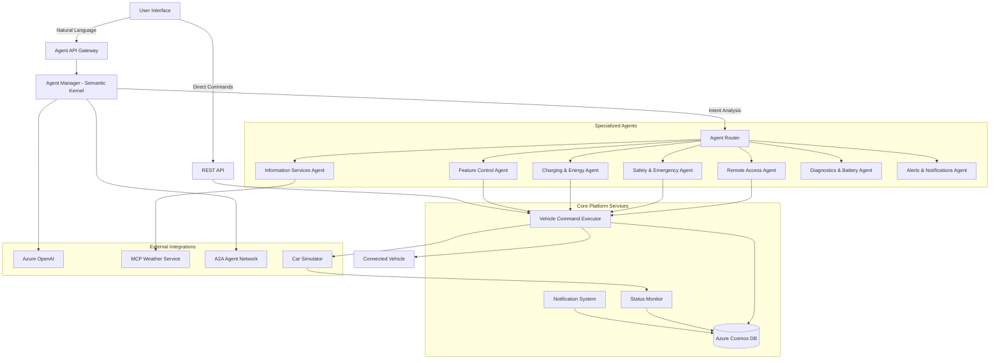
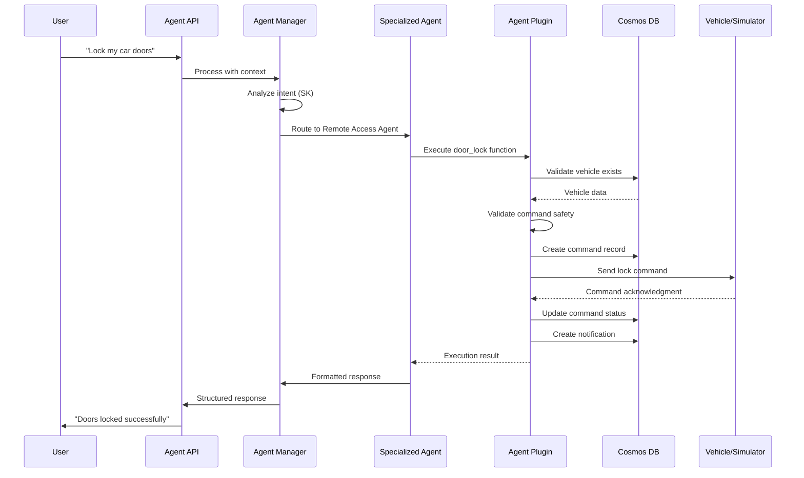

# Agentic Connected Vehicle Platform

An intelligent vehicle management platform where specialized AI agents handle different aspects of vehicle operations and user interactions through natural language processing. Built with FastAPI, Semantic Kernel, React.js, and Azure Cloud Services.

## Project Details
- **Features**  
  Natural-language agent interface; Remote access (lock/unlock, engine start/stop); EV charging & energy optimization; Weather, traffic & POI info; In-car controls (climate, lights, windows); Diagnostics & predictive maintenance; Alerts & notifications.
- **Tech Stack**  
  Python 3.12+, FastAPI, Semantic Kernel, Azure Cosmos DB (AAD auth), Azure OpenAI, React.js, Material-UI.
- **Deployment**  
  Azure App Service, Azure Cosmos DB, Azure OpenAI Service, AAD authentication.

## System Overview

### Core Architecture

The platform implements a sophisticated multi-agent system that provides two primary interaction modes:

1. **Direct API Operations** - Traditional REST API endpoints for vehicle management, command execution, and data retrieval
2. **Agentic Interface** - Natural language interactions with specialized agents that interpret user intent and perform contextual actions

### Key Components

- **Agent Manager** - Central orchestrator using Semantic Kernel for intent interpretation and agent coordination
- **Specialized Agents** - Domain-specific agents for vehicle operations (7 specialized agents)
- **Vehicle Management** - Comprehensive vehicle profiles, status monitoring, and service records
- **Command Execution** - Asynchronous vehicle control operations with real-time status tracking
- **Azure Integration** - Cosmos DB for persistence, Azure OpenAI for intelligence
- **MCP Integration** – Model Context Protocol servers for weather, traffic, points of interest, and navigation
- **Car Simulator** - Advanced vehicle behavior simulation for testing and development

## Specialized Agent System

The platform features a purpose-driven agent architecture where each agent specializes in specific vehicle domains:

### 🚗 **Remote Access Agent**
Controls vehicle access and remote operations:
- **Door Control** - Lock/unlock individual or all doors with safety validations
- **Engine Control** - Remote start/stop with proper safety checks
- **Horn & Lights** - Vehicle location assistance
- **Command Validation** - Ensures safe command execution

### 🚨 **Safety & Emergency Agent**
Handles critical safety situations and emergency response:
- **Emergency Calls** - Automatic eCall initiation with precise location data
- **Collision Detection** - Real-time collision alert processing and emergency dispatch
- **Theft Protection** - Vehicle theft reporting with location tracking
- **SOS Requests** - Manual emergency assistance with priority handling

### ⚡ **Charging & Energy Agent**
Manages electric vehicle charging and energy optimization:
- **Charging Stations** - Find nearby stations with real-time availability and pricing
- **Charging Control** - Start/stop charging sessions with safety monitoring
- **Energy Analytics** - Usage tracking, efficiency analysis, regenerative braking data
- **Range Estimation** - Dynamic range calculation based on driving conditions and battery health

### 📍 **Information Services Agent**
Provides real-time contextual information and navigation:
- **Weather Services** - Current conditions and forecasts via MCP integration
- **Traffic Information** - Real-time traffic conditions, incidents, and route optimization
- **Points of Interest** - Nearby restaurants, services, fuel stations, and attractions
- **Navigation** - Route planning with real-time updates

### 🎛️ **Vehicle Feature Control Agent**
Manages in-car comfort and convenience features:
- **Climate Control** - Temperature, fan speed, A/C, and heating with smart presets
- **Lighting Control** - Headlights, interior lights, and hazard lights
- **Window Control** - Individual or group window operation
- **Seat Management** - Seat heating, positioning, and memory settings

### 🔧 **Diagnostics & Battery Agent**
Monitors vehicle health and predictive maintenance:
- **System Diagnostics** - Comprehensive ECU monitoring and error code analysis
- **Battery Health** - Voltage monitoring, capacity analysis, and replacement scheduling
- **Predictive Maintenance** - AI-driven service interval recommendations
- **Performance Analytics** - Engine efficiency, fuel consumption, and wear patterns

### 🔔 **Alerts & Notifications Agent**
Manages proactive monitoring and user preferences:
- **Speed Alerts** - Configurable speed limit notifications with customizable thresholds
- **Curfew Monitoring** - Time-based vehicle usage alerts for fleet management
- **Battery Warnings** - Intelligent low battery and charging reminders
- **Maintenance Alerts** - Proactive service scheduling and parts replacement notifications

## System Architecture

### Multi-Agent Communication Flow



### Agent Processing Workflow



## API Specifications
### Agent System APIs
- `POST /api/agent/ask`  
  Universal agent interface: natural-language queries → appropriate specialized agents → structured JSON response.
- `POST /api/agent/remote-access`  
  Lock/unlock doors, start/stop engine, lights/horn control.
- `POST /api/agent/safety-emergency`  
  Emergency calls, collision alerts, theft protection, SOS requests.
- `POST /api/agent/charging-energy`  
  Find/start/stop charging, energy analytics, range estimation.
- `POST /api/agent/information-services`  
  Weather, traffic, POI lookup, route planning.
- `POST /api/agent/feature-control`  
  Climate control, lighting, windows, seat settings.
- `POST /api/agent/diagnostics-battery`  
  System diagnostics, battery health, predictive maintenance.
- `POST /api/agent/alerts-notifications`  
  Speed alerts, curfew monitoring, battery & maintenance notifications.

### Core Platform APIs
- `GET /api/vehicles`                  List all vehicles  
- `POST /api/vehicle`                  Add a new vehicle profile  
- `GET /api/vehicle/{id}/status`       Get current status  
- `GET /api/vehicle/{id}/status/stream` Stream real-time status  
- `PUT /api/vehicle/{id}/status`       Update vehicle status  
- `POST /api/command`                  Submit a control command  
- `GET /api/commands`                  Retrieve command history  
- `GET /api/notifications`             Retrieve system notifications

```bash
# List all vehicles
curl http://localhost:8000/api/vehicles

# Add a new vehicle
curl -X POST http://localhost:8000/api/vehicle \
  -H "Content-Type: application/json" \
  -d '{
    "id": "vehicle-123",
    "make": "Tesla",
    "model": "Model 3",
    "year": 2021,
    "vin": "5YJ3E1EA7LF000001"
  }'

# Get current status
curl http://localhost:8000/api/vehicle/vehicle-123/status

# Stream status updates (SSE)
curl -N http://localhost:8000/api/vehicle/vehicle-123/status/stream

# Update vehicle status
curl -X PUT http://localhost:8000/api/vehicle/vehicle-123/status \
  -H "Content-Type: application/json" \
  -d '{
    "status": "offline",
    "battery": 80
  }'

# Submit a control command
curl -X POST http://localhost:8000/api/command \
  -H "Content-Type: application/json" \
  -d '{
    "vehicle_id": "vehicle-123",
    "type": "LOCK_DOORS",
    "parameters": { "doors": "all" }
  }'

# Get command history
curl http://localhost:8000/api/commands

# Get notifications
curl http://localhost:8000/api/notifications
```

### Analytics & Insights
- `POST /api/analyze/vehicle-data`     Vehicle telemetry analysis  
- `POST /api/recommend/services`       Service & maintenance recommendations

## Getting Started

### Prerequisites

- **Python 3.12+** with pip
- **Node.js 16+** with npm
- **Azure Subscription** for cloud services
- **Azure CLI** for authentication and resource management

### Quick Start with Azure

1. **Create Azure Resources**
   ```bash
   # Login to Azure
   az login
   
   # Create resource group
   az group create --name rg-connected-car --location eastus
   ```

2. **Configure Authentication**
   ```bash
   # Set up Azure AD authentication for Cosmos DB
   az login --tenant <your-tenant-id>

   # Dev: Get a user principal ID in Entra ID
   # Prod: Get a principal ID for the App Service
   PRINCIPAL_ID=$(az ad signed-in-user show --query id -o tsv)
   SUBSCRIPTION_ID=$(az account show --query id -o tsv)
   
   az cosmosdb sql role assignment create \
     --resource-group rg-connected-car \
     --account-name cosmos-connected-car \
     --role-definition-id 00000000-0000-0000-0000-000000000002 \
     --principal-id $PRINCIPAL_ID
     --scope "/"
   ```

3. **Backend Setup**
   ```bash
   cd vehicle
   poetry install
   cp .env.sample .env
   # Generate sample data
   poetry run python tests/cosmos_data_generator.py --vehicles 10 --services 5 --commands 8
   # Run tests
   poetry run pytest
   # Run the server
   python main.py
   ```

4. **Frontend Setup**
   ```bash
   cd web

   # Install yarn
   npm install -g yarn
   
   # Install dependencies
   yarn install
   
   # Start development server
   yarn start
   ```

5. **Access the Platform**
   - **Backend API**: http://localhost:8000
   - **Frontend UI**: http://localhost:3000
   - **API Documentation**: http://localhost:8000/docs

### Manual Configuration

If you prefer manual setup, create a `.env` file in the `vehicle/` directory:

```env
# Azure Cosmos DB
COSMOS_DB_ENDPOINT=https://<your-cosmos-account>.documents.azure.com:443/
COSMOS_DB_KEY=<your_cosmos_key_or_use_aad>
COSMOS_DB_USE_AAD=true
COSMOS_DB_DATABASE=VehiclePlatformDB

# Azure OpenAI
AZURE_OPENAI_ENDPOINT=https://<your-openai>.openai.azure.com/
AZURE_OPENAI_API_KEY=<your_openai_key>
AZURE_OPENAI_DEPLOYMENT_NAME=
AZURE_OPENAI_API_VERSION=

# Application Settings
LOG_LEVEL=INFO
API_HOST=0.0.0.0
API_PORT=8000
```

## Advanced Features

### Real-time Agent Streaming
Enable streaming responses for natural conversations:

```javascript
const response = await fetch('/api/agent/ask', {
  method: 'POST',
  headers: { 'Content-Type': 'application/json' },
  body: JSON.stringify({
    query: "Prepare my car for a long trip",
    context: { vehicle_id: "my-car" },
    stream: true
  })
});

const reader = response.body.getReader();
// Process streaming chunks...
```

### Custom Agent Development
Extend the platform with custom agents:

```python
from semantic_kernel.functions import kernel_function
from typing import Dict, Any, Optional

class MyCustomPlugin:
    @kernel_function(description="Custom vehicle operation")
    async def my_custom_function(self, vehicle_id: str) -> Dict[str, Any]:
        # Implement custom logic
        return {"message": "Custom operation completed", "success": True}
```

## Production Deployment

### Azure App Service Deployment
```bash
# Create App Service plan
az appservice plan create --resource-group rg-connected-car --name plan-connected-car --sku B1 --is-linux

# Create web app
az webapp create --resource-group rg-connected-car --plan plan-connected-car --name app-connected-car --runtime "PYTHON|3.12"

# Deploy application
az webapp up --name app-connected-car --resource-group rg-connected-car
```

### Security Configuration
```python
# Production CORS settings
app.add_middleware(
    CORSMiddleware,
    allow_origins=["https://your-domain.com"],
    allow_credentials=True,
    allow_methods=["GET", "POST", "PUT", "DELETE"],
    allow_headers=["*"],
)

# Enable Azure Key Vault for secrets
from azure.keyvault.secrets import SecretClient
```

## Monitoring & Observability

### Structured Logging
```python
from utils.logging_config import get_logger
logger = get_logger(__name__)

### Health Checks
- `GET /api/health` - Application health status
- `GET /api/` - Detailed service status including Azure connectivity

## Troubleshooting

### Common Issues

1. **Azure Authentication Errors**
   ```bash
   # Verify Azure login
   az account show
   
   # Check Cosmos DB permissions
   az cosmosdb sql role assignment list --resource-group rg-connected-car --account-name cosmos-connected-car
   ```

2. **Agent Response Issues**
   - Verify Azure OpenAI deployment name and endpoint
   - Check Semantic Kernel plugin registration in agent initialization
   - Review structured logs for detailed error information

3. **Cosmos DB Connection Issues**
   ```bash
   # Test connection
   python -c "
   from azure.cosmos_db import cosmos_client
   import asyncio
   asyncio.run(cosmos_client.connect())
   print('Connection successful')
   "
   ```

4. **MCP Service Issues**
   - Ensure MCP servers are running on the correct ports:
     - Weather: 8001
     - Traffic: 8002
     - Points of Interest: 8003
     - Navigation: 8004
   - Check firewall settings for external API access
   - Verify plugin configuration in Information Services Agent

## License

This project is licensed under the MIT License.