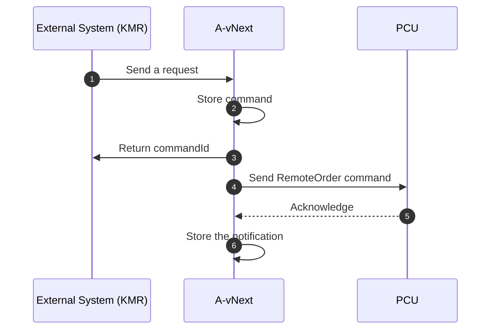

Create an agentic-connected-vehicle platform where each component operates as an OpenAI Agent.

## Components

- **Vehicle Profile Manager**  
  Manages: Country, Region, Manufactured Year, Brand, VehicleId, VehicleModel, DataDictionaryType, DataDictionaryVersion  

- **Vehicle Service Manager**  
  Handles: List of Services (Service Code, Description, Start Date, End Date)  

- **Vehicle API/Command Executor**  
  Core module for receiving commands via API from the web app and sending them to vehicle devices  

- **Vehicle Data Management**  
  Manages: DataDictionary, vehicle logs, data analysis  

- **Vehicle Notification Handler**  
  Sends notifications to the web app once command execution is complete  

## System Flow (Async Command Handling)

- Commands, acknowledgements, and notifications are managed by separate asynchronous handlers for performance and scalability.

## Car Simulator

- **Dashboard UI (React.js)**  
  Displays:  
  - Car status (Battery, Temperature, Speed, Oil usage/remaining)  
  - Service system info (Received/Sent Commands, Services, Notifications)  

- **Backend (Python)**  
  - Hosts platform logic, agent orchestration, data handling  

## Tech Stack

- **Backend:** Python  
- **Frontend:** React.js  
- **Architecture:** Agent-based model using OpenAI Agents

-----

I noticed that the concept of "agent" in this application is currently unclear. The application appears to function even without agent-specific features, which introduces unnecessary redundancy in the codebase. To improve clarity and maintainability, the agent feature should be explicitly defined and purpose-driven.

In the proposed design, the agent system responds to client messages. It should first understand the user's intention and then delegate tasks to the appropriate specialized agents based on the service or command requested.

The agent system consists of the following components:

1. **AgentManager** – Interprets user intent and delegates tasks to the appropriate specialized agent.
2. **Remote Access Agent** – Controls vehicle access and remote operations such as door locking, engine start, and syncing personal data.
3. **Safety & Emergency Agent** – Handles emergency-related features including collision alerts, and theft notifications.
4. **Charging & Energy Agent** – Manages electric vehicle charging operations, energy usage tracking, and charging station information.
5. **Information Services Agent** – Provides real-time vehicle-related information such as weather, traffic, and points of interest.
6. **Vehicle Feature Control Agent** – Manages in-car features like climate settings, temperature control, and service subscriptions.
7. **Diagnostics & Battery Agent** – Oversees vehicle diagnostics, battery status, and system health reports.
8. **Alerts & Notifications Agent** – Sends critical alerts such as speed violations, curfew breaches, and battery warnings.