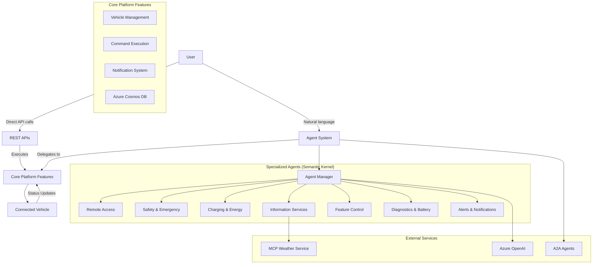
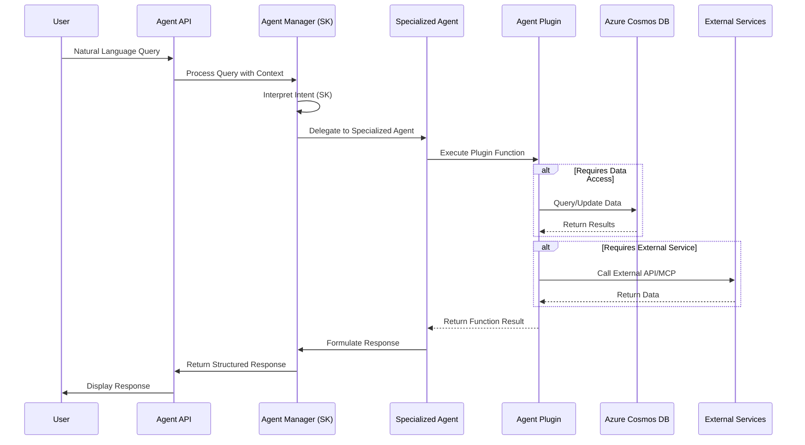

# Agentic Connected Vehicle Platform

This project implements an agentic-connected-vehicle platform leveraging specialized agents to enhance the user experience through natural language interaction. The platform supports both direct API interactions and agent-mediated operations with Azure integration and Agent-to-Agent (A2A) communication.

## System Overview

### Core Features

The platform provides two primary modes of interaction:

1. **Direct API Operations** - Traditional REST API endpoints for vehicle management, command execution, and data retrieval.
2. **Agentic Interface** - Natural language interactions with specialized agents that interpret user intent and perform appropriate actions.
3. **Agent-to-Agent Communication** - A2A protocol support for inter-agent communication and coordination.

### Components

- **Vehicle Management** - Profiles, data, and service records stored in Azure Cosmos DB
- **Command Execution** - Vehicle control operations with async processing
- **Notification System** - Status updates and alerts
- **Agent System** - Natural language interface with specialized domain agents
- **MCP Integration** - Model Context Protocol for weather and external services
- **A2A Communication** - Agent-to-Agent protocol for distributed agent coordination

## Specialized Agent System

The platform implements a purpose-driven agent system that delegates tasks based on user intent. Each agent specializes in a specific domain:

- **AgentManager** – Interprets user intent and delegates tasks to appropriate specialized agents using Semantic Kernel
- **Remote Access Agent** – Controls vehicle access and remote operations (door locking, engine start, data sync)
- **Safety & Emergency Agent** – Handles emergency-related features and safety alerts
- **Charging & Energy Agent** – Manages EV charging operations, energy tracking, and charging station location
- **Information Services Agent** – Provides real-time information (weather via MCP, traffic, POIs, navigation)
- **Vehicle Feature Control Agent** – Manages in-car features and service recommendations
- **Diagnostics & Battery Agent** – Oversees vehicle diagnostics, battery status, and system health
- **Alerts & Notifications Agent** – Manages critical alerts and notification preferences

## System Architecture

### Interaction Modes



### Agent Communication Flow



## Screenshots & Demo

### Platform Overview

The Agentic Connected Vehicle Platform provides an intuitive web interface for interacting with connected vehicles through both traditional controls and natural language commands.


*Main dashboard showing vehicle status, recent commands, and system notifications*

### Agent-Based Natural Language Interface

Users can interact with their vehicles using natural language through specialized agents that understand context and intent.


*Natural language interaction with the agent system for vehicle control*

### Vehicle Management & Control

The platform provides comprehensive vehicle management capabilities with real-time status monitoring and command execution.


*Vehicle control interface showing available commands and current status*


## Project Structure

The platform is organized with the following directory structure:

```
vehicle/                    # Main backend application
├── agents/                 # Agent implementations
│   ├── base/              # Base agent classes and utilities
│   │   ├── base_agent.py         # Abstract base agent class
│   │   └── a2a_server_init.py    # A2A server initialization
│   ├── a2a_common/        # Agent-to-Agent communication
│   │   ├── client/        # A2A client implementation
│   │   ├── server/        # A2A server implementation
│   │   └── types/         # A2A protocol types
│   ├── a2a_host/          # A2A host services
│   ├── agent_manager.py          # Central agent coordinator
│   ├── remote_access_agent.py    # Remote vehicle access
│   ├── safety_emergency_agent.py # Safety and emergency
│   ├── charging_energy_agent.py  # EV charging and energy
│   ├── information_services_agent.py # Information services
│   ├── vehicle_feature_control_agent.py # Feature control
│   ├── diagnostics_battery_agent.py # Diagnostics and battery
│   └── alerts_notifications_agent.py # Alerts and notifications
├── apis/                  # API route handlers
│   └── agent_routes.py           # Agent-specific API endpoints
├── azure/                 # Azure services integration
│   └── cosmos_db.py              # Cosmos DB client with AAD support
├── models/                # Data models
│   ├── command.py               # Command model
│   ├── vehicle_profile.py       # Vehicle profile model
│   ├── service.py              # Service model
│   ├── status.py               # Status model
│   └── vehicle_response.py     # Structured agent response model
├── plugin/                # External service integrations
│   ├── mcp_server.py           # MCP server integration
│   ├── weather_mcp.py          # Weather MCP implementation
│   ├── oai_service.py          # Azure OpenAI service
│   └── sk_plugin.py            # Semantic Kernel plugins
├── simulator/             # Vehicle simulator
│   └── car_simulator.py         # Vehicle behavior simulation
├── utils/                 # Utility functions
│   ├── agent_tools.py          # Shared agent utilities
│   └── logging_config.py       # Logging configuration
├── tests/                 # Backend tests
│   └── test_azure_integration.py # Azure integration tests
└── main.py               # FastAPI application entry point

web/                       # Frontend web application (React)
├── src/
│   ├── components/       # React components
│   │   ├── NotificationLog.js    # Notification display
│   │   ├── CommandLog.js         # Command history
│   │   └── AgentChat.js          # Agent interaction interface
│   ├── api/             # API client code
│   │   ├── vehicles.js          # Vehicle API client
│   │   ├── agents.js            # Agent API client
│   │   └── notifications.js     # Notifications API client
│   └── public/          # Static assets
└── package.json         # Frontend dependencies

scripts/                  # Utility scripts
├── start.sh             # Linux/Mac startup script
└── start.bat            # Windows startup script
```

## Implementation Notes

1. **Semantic Kernel Integration**:
   - All agents are built using Microsoft Semantic Kernel framework
   - Plugins provide the actual functionality while agents handle orchestration
   - Structured responses using Pydantic models for consistency

2. **Azure Integration**:
   - Azure Cosmos DB for data persistence with Change Feed support
   - Azure OpenAI for agent intelligence
   - Support for both master key and Azure AD authentication

3. **MCP (Model Context Protocol)**:
   - Weather information through MCP server integration
   - Extensible plugin architecture for external services

4. **A2A Communication**:
   - Agent-to-Agent protocol implementation
   - Support for distributed agent coordination
   - Push notification system for async communication

5. **Agent-Core Integration**:
   - Agents interpret user intent and delegate to appropriate core features
   - Business logic remains centralized while agents focus on interpretation
   - Consistent response formatting across all agents

## Getting Started

### Prerequisites

- Python 3.12+
- Node.js 16+
- Azure subscription (for Azure OpenAI, Cosmos DB)
- Azure CLI (for AAD authentication)

### Backend Setup

1. **Create Azure resources**
   ```bash
   # Create resource group
   az group create --name rg-connected-car --location eastus
   
   # Create Cosmos DB account
   az cosmosdb create --name cosmos-connected-car --resource-group rg-connected-car
   
   # Create Azure OpenAI resource (optional)
   az cognitiveservices account create --name openai-connected-car --resource-group rg-connected-car --kind OpenAI --sku S0 --location eastus
   ```

2. **Configure environment variables**
   ```bash
   # Create .env file in vehicle directory
   cat > vehicle/.env << EOF
   # Azure Cosmos DB
   COSMOS_DB_ENDPOINT=https://your-cosmos-account.documents.azure.com:443/
   COSMOS_DB_KEY=your_cosmos_key
   # Or use AAD authentication
   COSMOS_DB_USE_AAD=true
   
   # Azure OpenAI (optional)
   AZURE_OPENAI_ENDPOINT=https://your-openai.openai.azure.com/
   AZURE_OPENAI_API_KEY=your_openai_key
   AZURE_OPENAI_DEPLOYMENT_NAME=your_value
   ```

3. **Install dependencies**
   ```bash
   cd vehicle
   pip install -r requirements.txt
   ```

4. **Set up Azure AD role assignment** (if using AAD auth)
   ```bash
   # Get your user principal ID
   PRINCIPAL_ID=$(az ad signed-in-user show --query id -o tsv)
   
   # Assign Cosmos DB Data Contributor role
   az cosmosdb sql role assignment create \
     --resource-group rg-connected-car \
     --account-name cosmos-connected-car \
     --role-definition-id 00000000-0000-0000-0000-000000000002 \
     --principal-id $PRINCIPAL_ID \
     --scope "/subscriptions/$(az account show --query id -o tsv)/resourceGroups/rg-connected-car/providers/Microsoft.DocumentDB/databaseAccounts/cosmos-connected-car"
   ```

5. **Generate test data** (Optional)
   ```bash
   cd vehicle/azure
   # Generate sample data
   python cosmos_data_generator.py --vehicles 10 --services 5 --commands 8 --notifications 12 --status-updates 20
   
   # Or with live updates
   python cosmos_data_generator.py --live --duration 300 --interval 30
   ```

6. **Start the backend server**
   ```bash
   cd vehicle
   python main.py
   ```
   
   The backend will be available at http://localhost:8000

### Frontend Setup

1. **Install dependencies**
   ```bash
   cd web
   npm install
   ```

2. **Start the development server**
   ```bash
   npm start
   ```
   
   The frontend will be available at http://localhost:3000

### A2A Server Setup (Optional)

To enable Agent-to-Agent communication:

```bash
cd vehicle/agents/base
python a2a_server_init.py --port 10002
```

## API Reference

### Core Platform APIs

#### Vehicle Management
- `GET /api/vehicles` - List all vehicles
- `POST /api/vehicle` - Add a new vehicle profile
- `GET /api/vehicle/{vehicle_id}/status` - Get vehicle status
- `GET /api/vehicle/{vehicle_id}/status/stream` - Stream real-time status updates
- `GET /api/vehicle/{vehicle_id}/services` - List services for a vehicle
- `POST /api/vehicle/{vehicle_id}/service` - Add service to a vehicle

#### Command Execution
- `POST /api/command` - Submit a command to a vehicle
- `GET /api/commands` - Get command execution history

#### Notifications
- `GET /api/notifications` - Get system notifications

### Agent System APIs

#### General Agent Interface
- `POST /agent/ask` - General agent entry point with optional streaming
  ```json
  {
    "query": "Lock the doors on my vehicle",
    "context": {"vehicleId": "test-vehicle-1", "agentType": "remote-access"},
    "stream": false
  }
  ```

#### Specialized Agent Endpoints
- `POST /api/agent/remote-access` - Remote access operations
- `POST /api/agent/safety-emergency` - Safety and emergency features
- `POST /api/agent/charging-energy` - Charging and energy management
- `POST /api/agent/information-services` - Information services
- `POST /api/agent/feature-control` - Vehicle feature control
- `POST /api/agent/diagnostics-battery` - Diagnostics and battery status
- `POST /api/agent/alerts-notifications` - Alerts and notifications

#### Analytics Endpoints
- `POST /api/analyze/vehicle-data` - Analyze vehicle data using diagnostics agent
- `POST /api/recommend/services` - Get service recommendations

### Agent Response Format

All agent responses follow a consistent structure:

```json
{
  "response": "I've successfully locked all doors on your vehicle.",
  "success": true,
  "plugins_used": ["RemoteAccessPlugin"],
  "data": {
    "command_type": "LOCK_DOORS",
    "vehicle_id": "test-vehicle-1",
    "status": "sent",
    "command_id": "remote_access_lock_20240101120000"
  },
  "session_id": "abc123"
}
```

## Security Notes

### CORS Configuration
The API currently allows all origins for development. In production, restrict this:

```python
app.add_middleware(
    CORSMiddleware,
    allow_origins=["https://your-production-frontend.com"],
    allow_credentials=True,
    allow_methods=["*"],
    allow_headers=["*"],
)
```

### Azure Authentication
- Use Azure AD authentication for Cosmos DB in production
- Enable Azure OpenAI content filtering
- Implement proper API key management using Azure Key Vault

## Troubleshooting

### Common Issues

1. **Cosmos DB Connection Issues**
   ```bash
   # Verify Azure CLI login
   az account show
   
   # Check Cosmos DB permissions
   az cosmosdb sql role assignment list --resource-group rg-connected-car --account-name cosmos-connected-car
   ```

2. **Agent Response Issues**
   - Check Azure OpenAI endpoint and key configuration
   - Verify Semantic Kernel plugin registration
   - Review logs for detailed error information

3. **MCP Weather Service Issues**
   - Ensure MCP server is running
   - Check network connectivity for external weather APIs
   - Verify plugin configuration in agent initialization

## License

This project is licensed under the MIT License.
