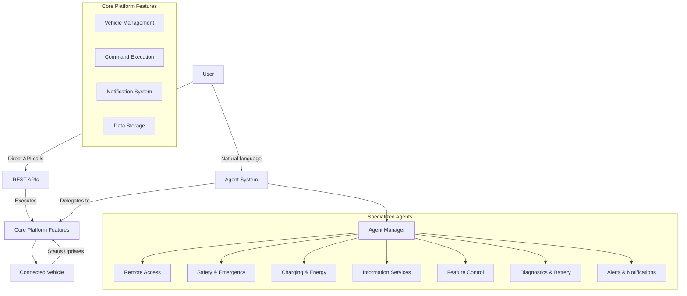
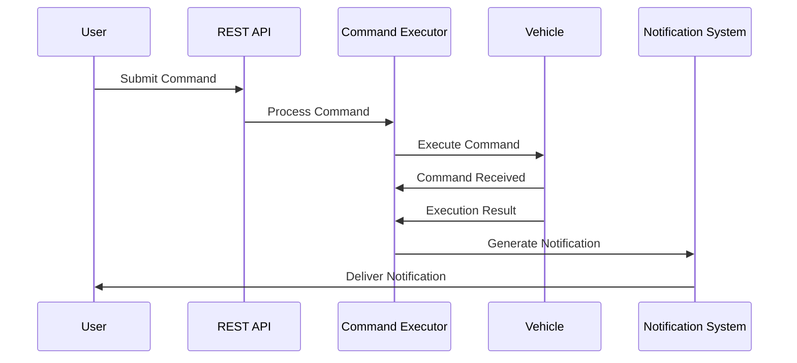
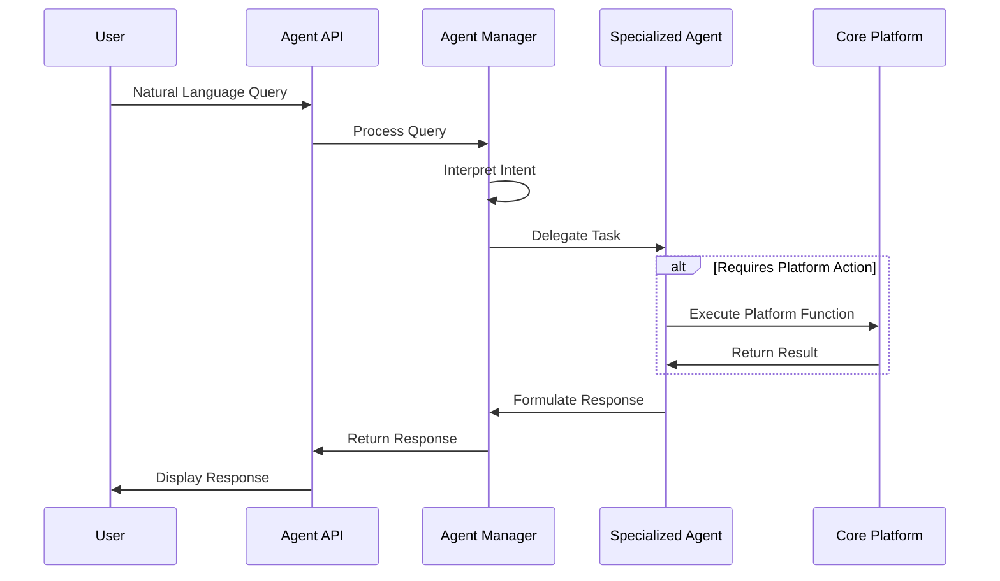

# Agentic Connected Vehicle Platform

This project implements an agentic-connected-vehicle platform leveraging specialized agents to enhance the user experience through natural language interaction. The platform supports both direct API interactions and agent-mediated operations.

## System Overview

### Core Features

The platform provides two primary modes of interaction:

1. **Direct API Operations** - Traditional REST API endpoints for vehicle management, command execution, and data retrieval.
2. **Agentic Interface** - Natural language interactions with specialized agents that interpret user intent and perform appropriate actions.

### Components

- **Vehicle Management** - Profiles, data, and service records
- **Command Execution** - Vehicle control operations
- **Notification System** - Status updates and alerts
- **Agent System** - Natural language interface to platform features

## Specialized Agent System

The platform implements a purpose-driven agent system that delegates tasks based on user intent. Each agent specializes in a specific domain:

- **AgentManager** – Interprets user intent and delegates tasks to the appropriate specialized agent
- **Remote Access Agent** – Controls vehicle access and remote operations
- **Safety & Emergency Agent** – Handles emergency-related features
- **Charging & Energy Agent** – Manages electric vehicle charging operations
- **Information Services Agent** – Provides real-time vehicle-related information
- **Vehicle Feature Control Agent** – Manages in-car features and service subscriptions
- **Diagnostics & Battery Agent** – Oversees vehicle diagnostics and health reports
- **Alerts & Notifications Agent** – Sends critical alerts and manages notification preferences

## System Architecture

### Interaction Modes



### Command Flow



### Agent System Flow



## Current Project Structure

The platform is organized with the following directory structure:

```
backend/
├── main.py                   # Application entry point
├── agents/                   # Agent system
│   ├── __init__.py           # Agent initialization
│   ├── agent_manager.py      # Central agent manager
│   ├── agent_routes.py       # Agent API endpoints
│   ├── base_agent.py         # Base agent class
│   ├── remote_access_agent.py         # Remote access functionality
│   ├── safety_emergency_agent.py      # Safety & emergency functionality
│   ├── charging_energy_agent.py       # Charging & energy management
│   ├── information_services_agent.py  # Information services
│   ├── vehicle_feature_control_agent.py # Vehicle feature control
│   ├── diagnostics_battery_agent.py   # Diagnostics & battery management
│   └── alerts_notifications_agent.py  # Alerts & notifications handling
├── azure/                    # Azure integrations
│   ├── azure_auth.py         # Azure authentication
│   ├── azure_init.py         # Azure resources initialization
│   ├── azure_vehicle_agent.py # Azure-based vehicle agent
│   └── cosmos_db.py          # Cosmos DB client
├── models/                   # Domain models
│   ├── command.py            # Command model
│   ├── notification.py       # Notification model
│   ├── service.py            # Service model
│   └── vehicle.py            # Vehicle model
├── simulator/                # Vehicle simulator
│   ├── __init__.py
│   └── car_simulator.py      # Car simulator implementation
├── utils/                    # Utilities
│   ├── agent_tools.py        # Agent tool implementations
│   └── semantic_kernel_manager.py # Semantic Kernel integration
└── vehicle_handler/          # Vehicle handlers
    ├── __init__.py
    ├── vehicle_api_executor.py        # API/command execution
    ├── vehicle_data_manager.py        # Vehicle data management
    ├── vehicle_handler.py             # Main vehicle handler
    ├── vehicle_notification_handler.py # Notification handling
    ├── vehicle_profile_manager.py     # Profile management
    └── vehicle_service_manager.py     # Service management
    
frontend/
├── public/                   # Publicly accessible files
│   └── index.html            # Main HTML file
├── src/                      # Source code
│   ├── api/                  # API clients
│   │   ├── apiClient.js      # Centralized API client
│   │   ├── commands.js       # Command API
│   │   ├── notifications.js  # Notifications API
│   │   ├── services.js       # Services API
│   │   ├── status.js         # Status API
│   │   └── vehicles.js       # Vehicles API
│   ├── auth/                 # Authentication
│   │   └── msalConfig.js     # Microsoft authentication
│   └── components/           # UI components
│       ├── AgentChat.js      # Agent chat interface
│       ├── CarSimulator.js   # Car simulator UI
│       ├── CarStatus.js      # Vehicle status display
│       ├── CommandLog.js     # Command log display
│       ├── Dashboard.js      # Main dashboard
│       ├── NotificationLog.js # Notification display
│       └── ServiceInfo.js    # Service information display
```

### Implementation Notes

1. **Core Features vs. Agent System**:
   - The core platform features function independently of the agent system
   - Users can interact directly with the platform via REST APIs
   - The agent system enhances the user experience with natural language processing

2. **Agent-Core Integration**:
   - Agents do not implement business logic directly
   - They interpret user intent and delegate to the appropriate core feature
   - This ensures business logic remains in one place and agents focus on interpretation and communication

3. **API Layer Integration**:
   - The frontend uses a centralized API client for all API calls
   - Backend implements a clean separation between direct API endpoints and agent routes

### Integration Approach

The platform allows seamless switching between direct API operations and natural language interactions:

- **Frontend Applications** can use standard REST APIs for programmatic access
- **Natural Language Interfaces** (chatbots, voice assistants) can utilize the agent system
- **Combined Interfaces** can offer both options, enhancing traditional UI with conversational features

## Getting Started

### Prerequisites

- Python 3.9+
- Node.js 14+
- Azure subscription (for Azure OpenAI, optional)

### Backend Setup

1. Create Azure OpenAI/Cosmos DB in the Azure portal

1. Navigate to the backend directory:
   ```
   cd backend
   ```

1. Install dependencies:
   ```
   pip install -r requirements.txt
   ```
   
   Or using Poetry:
   ```
   poetry install
   ```

1. Configure environment variables:
   - For Azure integration: `cp .env.azure.example .env.azure`

1. Start the backend server:
   ```
   # Standard mode
   python main.py

   Or
   
   # Windows batch file
   start.bat
   
   # Linux/Mac
   ./start.sh
   ```

### Frontend Setup

1. Navigate to the frontend directory:
   ```
   cd frontend
   ```

2. Install dependencies:
   ```
   npm install
   ```

   Or using yarn:
   ```
   yarn install
   ```

3. Ensure the public directory exists with required files:
   ```
   mkdir -p public
   ```

4. Start the development server:
   ```
   npm start
   ```

   Or using yarn:
   ```
   yarn start
   ```

## API Reference

### Core Platform APIs

#### Vehicle Management
- `GET /vehicles` - List all vehicles
- `POST /vehicle` - Add a new vehicle profile
- `GET /vehicle/{vehicle_id}/status` - Get vehicle status
- `GET /vehicle/{vehicle_id}/services` - List services for a vehicle
- `POST /vehicle/{vehicle_id}/service` - Add service to a vehicle

#### Command Execution
- `POST /command` - Submit a command to a vehicle
- `GET /commands` - Get command execution history

#### Notifications
- `GET /notifications` - Get system notifications

### Agent System APIs

#### Agent System Entry Point
- `POST /api/agent/ask` - General agent system entry point for any natural language query

#### Specialized Agent Endpoints
- `POST /api/agent/remote-access` - Remote vehicle access operations
- `POST /api/agent/safety-emergency` - Safety and emergency features
- `POST /api/agent/charging-energy` - Charging and energy management
- `POST /api/agent/information-services` - Vehicle information services
- `POST /api/agent/feature-control` - Vehicle feature control
- `POST /api/agent/diagnostics-battery` - Diagnostics and battery management
- `POST /api/agent/alerts-notifications` - Alerts and notification settings

#### Analysis Endpoints
- `POST /api/analyze/vehicle-data` - Analyze vehicle diagnostic data
- `POST /api/recommend/services` - Get service recommendations

## Usage Examples

### Direct API Interaction

```javascript
// Send a command to lock doors
const response = await fetch('/command', {
  method: 'POST',
  headers: { 'Content-Type': 'application/json' },
  body: JSON.stringify({
    vehicleId: 'v123',
    commandType: 'LOCK_DOORS',
    parameters: { doors: 'all' }
  })
});
```

### Agent Interaction

```javascript
// Ask the agent system to handle a natural language request
const response = await fetch('/api/agent/ask', {
  method: 'POST',
  headers: { 'Content-Type': 'application/json' },
  body: JSON.stringify({
    query: "Lock all doors on my car and turn on the climate control to 22 degrees",
    context: { vehicle_id: 'v123' }
  })
});
```

## Implementation Plan

### Current Implementation Status

The project includes these key components:

1. **Backend Architecture**
   - Specialized agents for different domains (Remote Access, Safety & Emergency, etc.)
   - Agent Manager for orchestrating user requests
   - Vehicle simulation for testing
   - Azure integration with Semantic Kernel and Cosmos DB
   - REST API endpoints for direct interaction

2. **Frontend Components**
   - Centralized API client for consistent backend communication
   - Car Simulator UI
   - Command and notification logs
   - Vehicle status display
   - Agent chat interface

3. **Recent Refactoring Changes**
   - Fixed import paths for Azure modules
   - Removed obsolete and unused utility files
   - Standardized frontend API layer with a centralized client
   - Improved code organization and reduced technical debt

### Next Steps

The following improvements are planned for future development:

1. **Enhanced Agent Capabilities**
   - Improve natural language processing capabilities
   - Expand the range of vehicle commands and queries supported
   - Implement more sophisticated intent recognition

2. **Architecture Improvements**
   - Continue refactoring toward a cleaner, feature-based organization
   - Implement proper error handling and retries for API calls
   - Add comprehensive logging throughout the system

3. **Testing Enhancements**
   - Expand test coverage for agent interactions
   - Add integration tests for the complete command flow
   - Implement automated UI testing for frontend components

4. **Security Enhancements**
   - Implement proper authentication and authorization
   - Add input validation throughout API endpoints
   - Secure sensitive operations with additional verification

## Contributing

Contributions are welcome! Please follow these guidelines:

1. Fork the repository
2. Create a feature branch: `git checkout -b feature/your-feature-name`
3. Commit your changes: `git commit -m 'Add some feature'`
4. Push to the branch: `git push origin feature/your-feature-name`
5. Open a pull request

## License

This project is licensed under the MIT License - see the LICENSE file for details.
