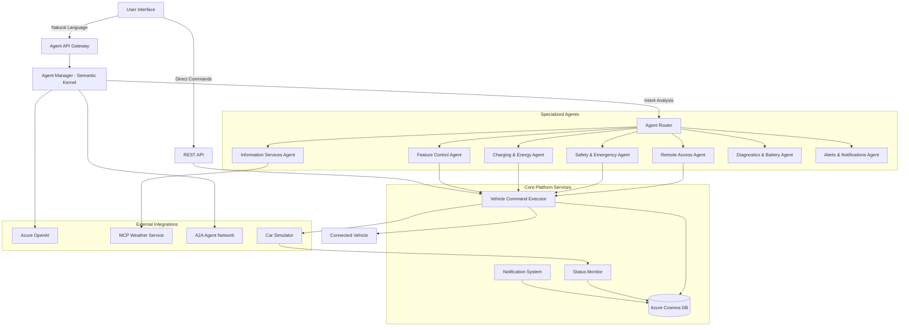
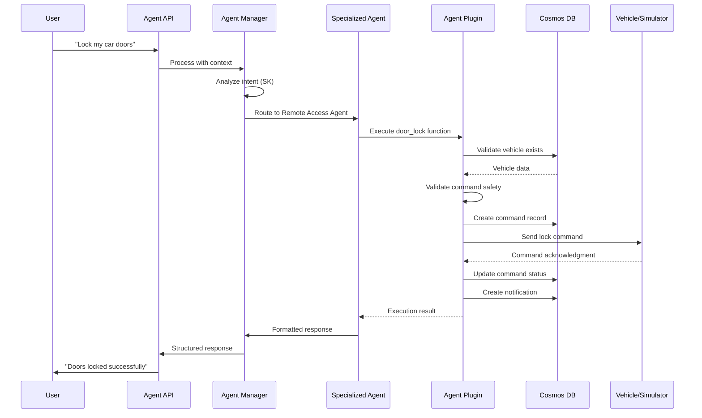

# Agentic Connected Vehicle Platform

An intelligent vehicle management platform where specialized AI agents handle different aspects of vehicle operations and user interactions through natural language processing. Built with FastAPI, Semantic Kernel, React.js, and Azure Cloud Services.

## System Overview

### Core Architecture

The platform implements a sophisticated multi-agent system that provides two primary interaction modes:

1. **Direct API Operations** - Traditional REST API endpoints for vehicle management, command execution, and data retrieval
2. **Agentic Interface** - Natural language interactions with specialized agents that interpret user intent and perform contextual actions

### Key Components

- **Agent Manager** - Central orchestrator using Semantic Kernel for intent interpretation and agent coordination
- **Specialized Agents** - Domain-specific agents for vehicle operations (7 specialized agents)
- **Vehicle Management** - Comprehensive vehicle profiles, status monitoring, and service records
- **Command Execution** - Asynchronous vehicle control operations with real-time status tracking
- **Azure Integration** - Cosmos DB for persistence, Azure OpenAI for intelligence
- **MCP Integration** - Model Context Protocol for weather and external services
- **Car Simulator** - Advanced vehicle behavior simulation for testing and development

## Specialized Agent System

The platform features a purpose-driven agent architecture where each agent specializes in specific vehicle domains:

### 🚗 **Remote Access Agent**
Controls vehicle access and remote operations:
- **Door Control** - Lock/unlock individual or all doors with safety validations
- **Engine Control** - Remote start/stop with proper safety checks
- **Horn & Lights** - Vehicle location assistance
- **Command Validation** - Ensures safe command execution

### 🚨 **Safety & Emergency Agent**
Handles critical safety situations and emergency response:
- **Emergency Calls** - Automatic eCall initiation with precise location data
- **Collision Detection** - Real-time collision alert processing and emergency dispatch
- **Theft Protection** - Vehicle theft reporting with location tracking
- **SOS Requests** - Manual emergency assistance with priority handling

### ⚡ **Charging & Energy Agent**
Manages electric vehicle charging and energy optimization:
- **Charging Stations** - Find nearby stations with real-time availability and pricing
- **Charging Control** - Start/stop charging sessions with safety monitoring
- **Energy Analytics** - Usage tracking, efficiency analysis, regenerative braking data
- **Range Estimation** - Dynamic range calculation based on driving conditions and battery health

### 📍 **Information Services Agent**
Provides real-time contextual information and navigation:
- **Weather Services** - Current conditions and forecasts via MCP integration
- **Traffic Information** - Real-time traffic conditions, incidents, and route optimization
- **Points of Interest** - Nearby restaurants, services, fuel stations, and attractions
- **Navigation** - Route planning with real-time updates

### 🎛️ **Vehicle Feature Control Agent**
Manages in-car comfort and convenience features:
- **Climate Control** - Temperature, fan speed, A/C, and heating with smart presets
- **Lighting Control** - Headlights, interior lights, and hazard lights
- **Window Control** - Individual or group window operation
- **Seat Management** - Seat heating, positioning, and memory settings

### 🔧 **Diagnostics & Battery Agent**
Monitors vehicle health and predictive maintenance:
- **System Diagnostics** - Comprehensive ECU monitoring and error code analysis
- **Battery Health** - Voltage monitoring, capacity analysis, and replacement scheduling
- **Predictive Maintenance** - AI-driven service interval recommendations
- **Performance Analytics** - Engine efficiency, fuel consumption, and wear patterns

### 🔔 **Alerts & Notifications Agent**
Manages proactive monitoring and user preferences:
- **Speed Alerts** - Configurable speed limit notifications with customizable thresholds
- **Curfew Monitoring** - Time-based vehicle usage alerts for fleet management
- **Battery Warnings** - Intelligent low battery and charging reminders
- **Maintenance Alerts** - Proactive service scheduling and parts replacement notifications

## System Architecture

### Multi-Agent Communication Flow



### Agent Processing Workflow



## Technology Stack

### Backend (Python 3.12+)
- **FastAPI** - High-performance async web framework
- **Semantic Kernel** - Microsoft's AI orchestration framework for agent coordination
- **Azure Cosmos DB** - NoSQL database with change feed support
- **Azure OpenAI** - GPT-4 integration for natural language understanding
- **Azure Identity** - AAD authentication and secure credential management
- **Pydantic** - Data validation and serialization
- **Loguru** - Structured logging with Azure integration
- **Uvicorn** - ASGI server for production deployment

### Frontend (React.js)
- **React 18** - Modern component-based UI framework
- **Material-UI** - Professional component library
- **Recharts** - Data visualization for vehicle telemetry
- **WebSocket/SSE** - Real-time updates and streaming responses

### Cloud Infrastructure
- **Azure Cosmos DB** - Multi-model database with global distribution
- **Azure OpenAI Service** - Enterprise-grade AI with content filtering
- **Azure Identity** - Secure authentication and authorization
- **Model Context Protocol (MCP)** - Standardized external service integration

## Project Structure

```
agentic-connected-car-platform/
├── vehicle/                           # Backend FastAPI application
│   ├── agents/                        # Agent implementations
│   │   ├── agent_manager.py           # Central agent coordinator (Semantic Kernel)
│   │   ├── remote_access_agent.py     # Vehicle access control
│   │   ├── safety_emergency_agent.py  # Emergency response
│   │   ├── charging_energy_agent.py   # EV charging management
│   │   ├── information_services_agent.py # Information & navigation
│   │   ├── vehicle_feature_control_agent.py # Feature control
│   │   ├── diagnostics_battery_agent.py # Health monitoring
│   │   ├── alerts_notifications_agent.py # Alert management
│   │   └── base/                      # Base classes and A2A communication
│   ├── apis/                          # API route handlers
│   │   ├── agent_routes.py            # Agent-specific endpoints
│   │   ├── vehicle_feature_routes.py  # Feature control APIs
│   │   ├── remote_access_routes.py    # Remote access APIs
│   │   └── emergency_routes.py        # Emergency APIs
│   ├── azure/                         # Azure service integrations
│   │   ├── cosmos_db.py              # Cosmos DB client with AAD support
│   │   └── azure_init.py             # Azure resource provisioning
│   ├── models/                        # Data models and schemas
│   ├── plugin/                        # External service integrations
│   │   ├── mcp_server.py             # MCP weather service
│   │   ├── oai_service.py            # Azure OpenAI factory
│   │   └── sk_plugin.py              # Semantic Kernel plugins
│   ├── simulator/                     # Vehicle simulator
│   │   └── car_simulator.py          # Advanced vehicle behavior simulation
│   ├── utils/                         # Shared utilities
│   │   ├── agent_tools.py            # Agent helper functions
│   │   ├── semantic_kernel_manager.py # SK integration
│   │   └── logging_config.py         # Structured logging
│   └── main.py                        # Application entry point
├── web/                               # React frontend application
│   ├── src/
│   │   ├── components/
│   │   │   ├── AgentChat.js          # Agent Chat UI
│   │   │   ├── CommandLog.js         # Command history
│   │   │   └── NotificationLog.js    # Notification history
│   │   ├── api/                      # API client implementations
│   │   └── ...
└── README.md                          
```

## Screenshots & Demo

### Dashboard Overview

*Comprehensive vehicle dashboard with real-time status, command history, and agent interactions*

### Natural Language Agent Interface

*Intuitive chat interface for natural language vehicle control through specialized agents*

### Vehicle Simulation & Control

*Advanced vehicle simulator showing real-time status updates and command execution*

## API Reference

### Agent System APIs

#### Universal Agent Interface
```http
POST /api/agent/ask
Content-Type: application/json

{
  "query": "Start my car and set temperature to 22 degrees",
  "context": {
    "vehicle_id": "test-vehicle-1",
    "agentType": "remote-access"
  },
  "stream": false
}
```

**Response:**
```json
{
  "response": "I've started your engine and set the temperature to 22°C.",
  "success": true,
  "plugins_used": ["RemoteAccessPlugin", "VehicleFeatureControlPlugin"],
  "data": {
    "commands_executed": [
      {
        "command_id": "engine_start_20240101120000",
        "type": "START_ENGINE",
        "status": "completed"
      },
      {
        "command_id": "climate_20240101120001",
        "type": "CLIMATE_CONTROL",
        "status": "completed",
        "temperature": 22
      }
    ]
  },
  "session_id": "session_abc123"
}
```

#### Specialized Agent Endpoints
- `POST /api/agent/remote-access` - Vehicle access and engine control
- `POST /api/agent/safety-emergency` - Emergency services and safety features
- `POST /api/agent/charging-energy` - EV charging and energy management
- `POST /api/agent/information-services` - Weather, traffic, and navigation
- `POST /api/agent/feature-control` - Climate, lighting, and comfort features
- `POST /api/agent/diagnostics-battery` - Health monitoring and diagnostics
- `POST /api/agent/alerts-notifications` - Alert management and preferences

### Core Platform APIs

#### Vehicle Management
```http
GET /api/vehicles                              # List all vehicles
POST /api/vehicle                             # Add vehicle profile
GET /api/vehicle/{vehicle_id}/status          # Get current status
GET /api/vehicle/{vehicle_id}/status/stream   # Stream real-time updates
PUT /api/vehicle/{vehicle_id}/status          # Update vehicle status
```

#### Command Execution
```http
POST /api/command        # Submit vehicle command
GET /api/commands        # Get command history
GET /api/notifications   # Get system notifications
```

#### Analytics & Insights
```http
POST /api/analyze/vehicle-data    # Vehicle data analysis
POST /api/recommend/services      # Service recommendations
```

## Getting Started

### Prerequisites

- **Python 3.12+** with pip
- **Node.js 16+** with npm
- **Azure Subscription** for cloud services
- **Azure CLI** for authentication and resource management

### Quick Start with Azure

1. **Create Azure Resources**
   ```bash
   # Login to Azure
   az login
   
   # Create resource group
   az group create --name rg-connected-car --location eastus
   
   # Run automated Azure setup
   cd vehicle/azure
   python azure_init.py \
     --resource-group rg-connected-car \
     --cosmos-account cosmos-connected-car \
     --location eastus
   ```

2. **Configure Authentication**
   ```bash
   # Set up Azure AD authentication for Cosmos DB
   PRINCIPAL_ID=$(az ad signed-in-user show --query id -o tsv)
   SUBSCRIPTION_ID=$(az account show --query id -o tsv)
   
   az cosmosdb sql role assignment create \
     --resource-group rg-connected-car \
     --account-name cosmos-connected-car \
     --role-definition-id 00000000-0000-0000-0000-000000000002 \
     --principal-id $PRINCIPAL_ID \
     --scope "/subscriptions/$SUBSCRIPTION_ID/resourceGroups/rg-connected-car/providers/Microsoft.DocumentDB/databaseAccounts/cosmos-connected-car"
   ```

3. **Backend Setup**
   ```bash
   cd vehicle
   
   # Install dependencies
   pip install -r requirements.txt
   
   # Configure environment (auto-generated by azure_init.py)
   cp .env.sample .env
   # Edit .env with your Azure OpenAI credentials
   
   # Generate sample data
   cd tests
   python cosmos_data_generator.py --vehicles 10 --services 5 --commands 8
   
   # Start backend server
   cd ..
   python main.py
   ```

4. **Frontend Setup**
   ```bash
   cd web
   
   # Install dependencies
   npm install
   
   # Start development server
   npm start
   ```

5. **Access the Platform**
   - **Backend API**: http://localhost:8000
   - **Frontend UI**: http://localhost:3000
   - **API Documentation**: http://localhost:8000/docs

### Manual Configuration

If you prefer manual setup, create a `.env` file in the `vehicle/` directory:

```env
# Azure Cosmos DB
COSMOS_DB_ENDPOINT=https://your-cosmos-account.documents.azure.com:443/
COSMOS_DB_KEY=your_cosmos_key_or_use_aad
COSMOS_DB_USE_AAD=true
COSMOS_DB_DATABASE=VehiclePlatformDB

# Azure OpenAI
AZURE_OPENAI_ENDPOINT=https://your-openai.openai.azure.com/
AZURE_OPENAI_API_KEY=your_openai_key
AZURE_OPENAI_DEPLOYMENT_NAME=gpt-4
AZURE_OPENAI_API_VERSION=2024-02-15-preview

# Application Settings
LOG_LEVEL=INFO
API_HOST=0.0.0.0
API_PORT=8000
```

## Advanced Features

### Real-time Agent Streaming
Enable streaming responses for natural conversations:

```javascript
const response = await fetch('/api/agent/ask', {
  method: 'POST',
  headers: { 'Content-Type': 'application/json' },
  body: JSON.stringify({
    query: "Prepare my car for a long trip",
    context: { vehicle_id: "my-car" },
    stream: true
  })
});

const reader = response.body.getReader();
// Process streaming chunks...
```

### Custom Agent Development
Extend the platform with custom agents:

```python
from agents.base.base_agent import BasePlugin
from semantic_kernel.functions import kernel_function

class MyCustomPlugin(BasePlugin):
    @kernel_function(description="Custom vehicle operation")
    async def my_custom_function(self, vehicle_id: str) -> Dict[str, Any]:
        # Implement custom logic
        return self._format_response("Custom operation completed")
```

## Production Deployment

### Azure App Service Deployment
```bash
# Create App Service plan
az appservice plan create --resource-group rg-connected-car --name plan-connected-car --sku B1 --is-linux

# Create web app
az webapp create --resource-group rg-connected-car --plan plan-connected-car --name app-connected-car --runtime "PYTHON|3.12"

# Deploy application
az webapp up --name app-connected-car --resource-group rg-connected-car
```

### Security Configuration
```python
# Production CORS settings
app.add_middleware(
    CORSMiddleware,
    allow_origins=["https://your-domain.com"],
    allow_credentials=True,
    allow_methods=["GET", "POST", "PUT", "DELETE"],
    allow_headers=["*"],
)

# Enable Azure Key Vault for secrets
from azure.keyvault.secrets import SecretClient
```

## Monitoring & Observability

### Structured Logging
```python
from utils.logging_config import get_logger
logger = get_logger(__name__)

### Health Checks
- `GET /api/health` - Application health status
- `GET /api/` - Detailed service status including Azure connectivity

## Troubleshooting

### Common Issues

1. **Azure Authentication Errors**
   ```bash
   # Verify Azure login
   az account show
   
   # Check Cosmos DB permissions
   az cosmosdb sql role assignment list --resource-group rg-connected-car --account-name cosmos-connected-car
   ```

2. **Agent Response Issues**
   - Verify Azure OpenAI deployment name and endpoint
   - Check Semantic Kernel plugin registration in agent initialization
   - Review structured logs for detailed error information

3. **Cosmos DB Connection Issues**
   ```bash
   # Test connection
   python -c "
   from azure.cosmos_db import cosmos_client
   import asyncio
   asyncio.run(cosmos_client.connect())
   print('Connection successful')
   "
   ```

4. **MCP Service Issues**
   - Ensure MCP weather server is running on port 8001
   - Check firewall settings for external API access
   - Verify plugin configuration in Information Services Agent

## License

This project is licensed under the MIT License. See [LICENSE](LICENSE) for details.