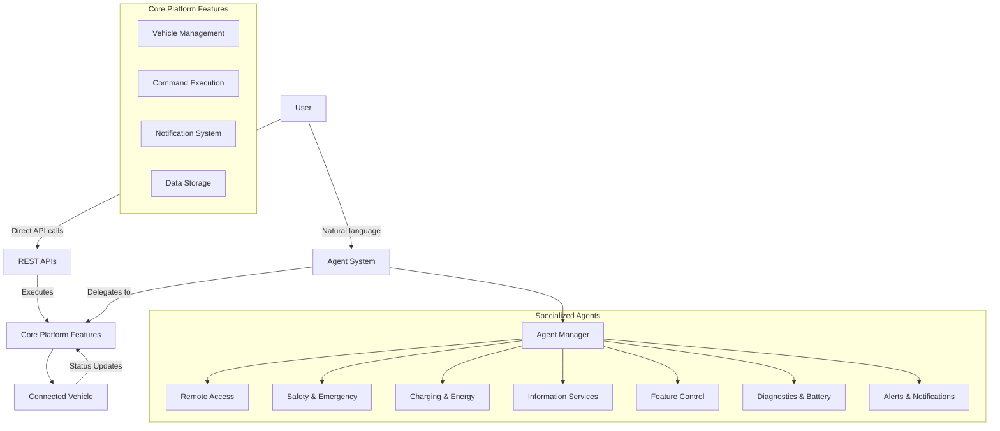
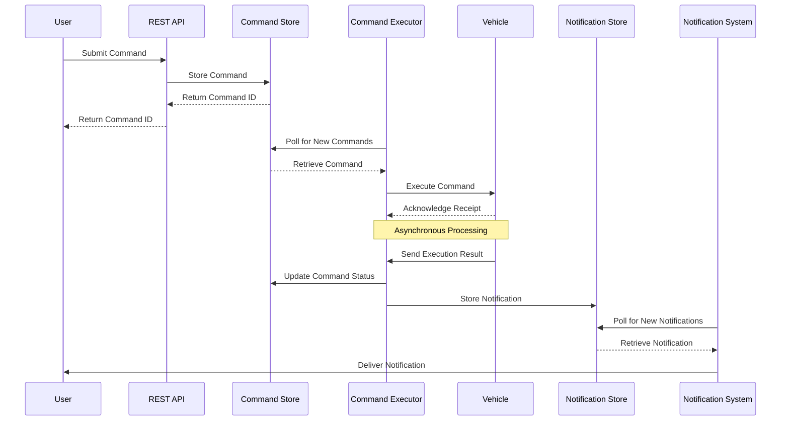
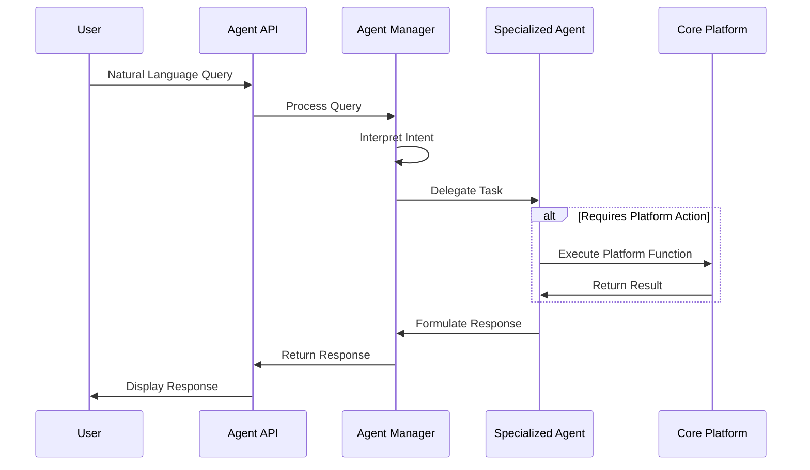

# Agentic Connected Vehicle Platform

This project implements an agentic-connected-vehicle platform leveraging specialized agents to enhance the user experience through natural language interaction. The platform supports both direct API interactions and agent-mediated operations.

## System Overview

### Core Features

The platform provides two primary modes of interaction:

1. **Direct API Operations** - Traditional REST API endpoints for vehicle management, command execution, and data retrieval.
2. **Agentic Interface** - Natural language interactions with specialized agents that interpret user intent and perform appropriate actions.

### Components

- **Vehicle Management** - Profiles, data, and service records
- **Command Execution** - Vehicle control operations
- **Notification System** - Status updates and alerts
- **Agent System** - Natural language interface to platform features

## Specialized Agent System

The platform implements a purpose-driven agent system that delegates tasks based on user intent. Each agent specializes in a specific domain:

- **AgentManager** – Interprets user intent and delegates tasks to the appropriate specialized agent
- **Remote Access Agent** – Controls vehicle access and remote operations such as door locking, engine start, and syncing personal data
- **Safety & Emergency Agent** – Handles emergency-related features including collision alerts, eCalls, and theft notifications
- **Information Services Agent** – Provides real-time vehicle-related information such as weather, traffic, points of interest, and navigation assistance
- **Vehicle Feature Control Agent** – Manages in-car features like climate settings, temperature control, and service subscriptions
- **Diagnostics & Battery Agent** – Oversees vehicle diagnostics, battery status, and system health reports
- **Alerts & Notifications Agent** – Manages critical alerts and notification preferences

## System Architecture

### Interaction Modes



### Command Flow



### Agent System Flow



## Project Structure

The platform is organized with the following directory structure:

```
├── api/              # Backend API code (Python)
│   ├── models/       # Data models
│   ├── agents/       # Agent implementations
│   │   ├── remote_access_agent.py        # Remote vehicle access operations
│   │   ├── safety_emergency_agent.py     # Safety and emergency features
│   │   ├── information_services_agent.py # Vehicle information services
│   │   ├── vehicle_feature_control_agent.py # Vehicle feature control
│   ├── azure/        # Azure services integration
│   │   ├── cosmos_db.py                  # Cosmos DB client  
│   │   ├── cosmos_data_generator.py      # Sample data generator
│   │   ├── azure_auth.py                 # AAD authentication middleware
│   │   ├── azure_init.py                 # Azure resource initialization
│   ├── simulator/    # Vehicle simulator
│   │   ├── car_simulator.py              # Simulates vehicle behavior
│   ├── utils/        # Utility functions
│   │   ├── agent_tools.py                # Shared agent utilities
│   ├── tests/        # Backend tests
│   │   ├── test_azure_integration.py     # Azure integration tests
├── web/              # Frontend web application (JavaScript/React)
│   ├── components/   # React components
│   │   ├── NotificationLog.js            # Notification display component
│   │   ├── CommandLog.js                 # Command history component
│   ├── api/          # API client code
│   │   ├── vehicles.js                   # Vehicle API client
│   │   ├── services.js                   # Services API client 
│   │   ├── status.js                     # Status updates API client
│   │   ├── notifications.js              # Notifications API client
│   │   ├── commands.js                   # Commands API client
│   ├── public/       # Static assets
│   │   ├── index.html                    # Main HTML template
├── scripts/          # Utility scripts for setup and maintenance
│   ├── start.sh                          # Linux/Mac startup script
│   ├── start.bat                         # Windows startup script
```

## Implementation Notes

1. **Core Features vs. Agent System**:
   - The core platform features function independently of the agent system
   - Users can interact directly with the platform via REST APIs
   - The agent system enhances the user experience with natural language processing

2. **Agent-Core Integration**:
   - Agents interpret user intent and delegate to the appropriate core feature
   - This ensures business logic remains in one place and agents focus on interpretation and communication

3. **API Layer Integration**:
   - The frontend uses a centralized API client for all API calls
   - Backend implements a clean separation between direct API endpoints and agent routes

4. **Azure Integration**:
   - Cosmos DB for data storage and real-time updates via Change Feed
   - Azure AD authentication support for secure access
   - Azure OpenAI integration for agent intelligence

## Getting Started

### Prerequisites

- Python 3.12+
- Node.js 14+
- Azure subscription (for Azure OpenAI, Cosmos DB)
- Azure CLI login (if using AAD authentication with Cosmos DB)

### Backend Setup

1. **Create Azure resources** (or use local development setup)
   - Cosmos DB account
   - Azure OpenAI service (optional)

2. **Configure environment variables**
   ```
   # Create a .env file in the vehicle directory
   COSMOS_DB_ENDPOINT=your_cosmos_endpoint
   COSMOS_DB_KEY=your_cosmos_key
   # For AAD auth instead of key-based auth
   COSMOS_DB_USE_AAD=true
   
   # OpenAI settings (if using Azure OpenAI)
   AZURE_OPENAI_ENDPOINT=your_openai_endpoint
   AZURE_OPENAI_API_KEY=your_openai_key
   AZURE_OPENAI_DEPLOYMENT_NAME=your_deployment_name
   ```

3. **Install backend dependencies**
   ```bash
   cd src/api
   pip install -e .
   # Or using Poetry
   poetry install
   ```

4. **Generate test data** (Optional)
   ```bash
   # Generate static test data with master key auth
   python azure/cosmos_data_generator.py --vehicles 10 --services 5 --commands 8 --notifications 12 --status-updates 20
   
   # Or use AAD authentication
   python azure/cosmos_data_generator.py --vehicles 10 --use-aad
   
   # Generate live-updating data
   python azure/cosmos_data_generator.py --live --duration 60 --interval 30
   ```

5. **Start the backend server**
   ```bash
   # Standard mode
   python main.py
   
   # Or using startup scripts
   # Windows:
   scripts/start.bat
   
   # Linux/Mac:
   scripts/start.sh
   ```

### Frontend Setup

1. **Install frontend dependencies**
   ```bash
   cd src/web
   npm install
   ```

2. **Start the development server**
   ```bash
   npm start
   ```
   
   The frontend will be available at http://localhost:3000

## API Reference

### Core Platform APIs

#### Vehicle Management
- `GET /vehicles` - List all vehicles
- `POST /vehicle` - Add a new vehicle profile
- `GET /vehicle/{vehicle_id}/status` - Get vehicle status
- `GET /vehicle/{vehicle_id}/status/stream` - Stream real-time vehicle status updates
- `GET /vehicle/{vehicle_id}/services` - List services for a vehicle
- `POST /vehicle/{vehicle_id}/service` - Add service to a vehicle

#### Command Execution
- `POST /command` - Submit a command to a vehicle
- `GET /commands` - Get command execution history

#### Notifications
- `GET /notifications` - Get system notifications

### Agent System APIs

- `POST /api/agent/ask` - General agent system entry point for any natural language query

## Security Notes

### CORS Configuration
The API currently allows all origins (`*`) for CORS. In production, you should restrict this to specific trusted origins:

```python
app.add_middleware(
    CORSMiddleware,
    allow_origins=["https://your-production-frontend.com"],
    allow_credentials=True,
    allow_methods=["*"],
    allow_headers=["*"],
)
```

### Azure AD Authentication
For production usage, enable Azure AD authentication by setting:
```
AZURE_AUTH_REQUIRED=true
```

## Azure Resources Management

When your Cosmos DB account doesn't allow key-based authentication, follow these steps to set up role-based access control:

### 🔑 Get Role Definition ID

```bash
az cosmosdb sql role definition list \
  --resource-group "<resource-group>" \
  --account-name "<cosmos-account>"
```

### 📍 Get Scope

```bash
az cosmosdb show \
  --resource-group "<resource-group>" \
  --name "<cosmos-account>" \
  --query "{id:id}"
```

### 👤 Get Principal ID

For local development (user identity):
```bash
az ad signed-in-user show --query id -o tsv
```

For managed identity:
```bash
az cosmosdb identity show \
  --resource-group "<resource-group>" \
  --name "<cosmos-account>" \
  --query principalId \
  --output tsv
```

### ✅ Assign Role

```bash
az cosmosdb sql role assignment create \
  --resource-group "<resource-group>" \
  --account-name "<cosmos-account>" \
  --role-definition-id "<role-definition-id>" \
  --principal-id "<principal-id>" \
  --scope "<scope>"
```

## License

This project is licensed under the MIT License - see the LICENSE file for details.
