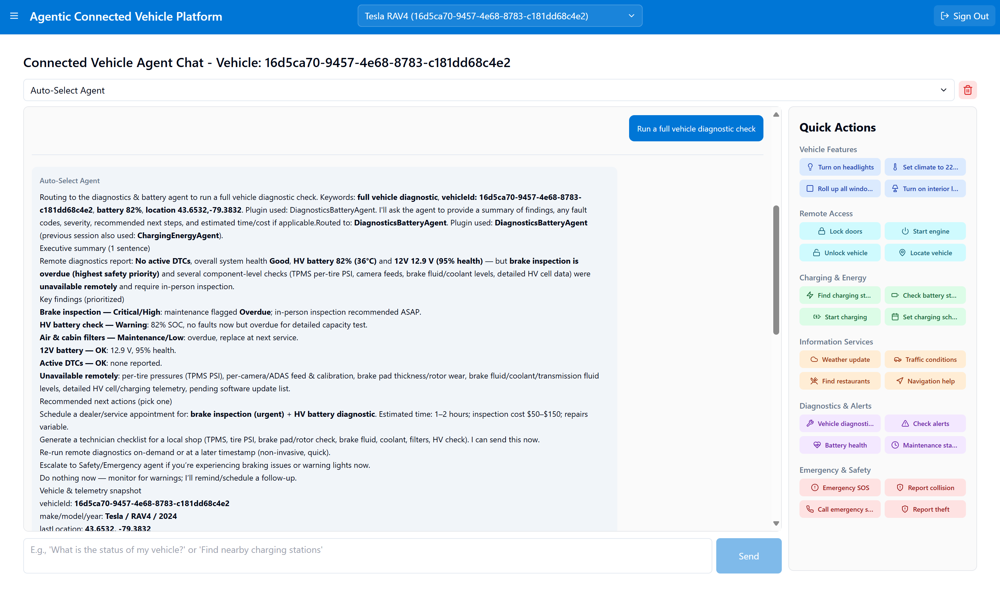
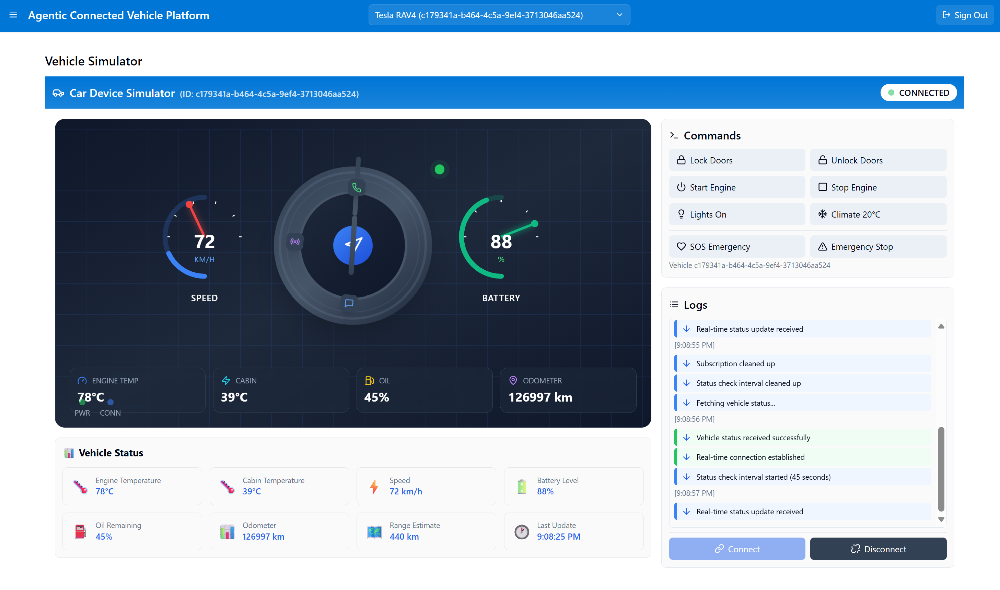

# 🚗 Agentic Connected Vehicle Platform

An AI-driven car management system: control, diagnostics, and insights via agents.

## ✨ Features
- 🗣️ Natural-language agent interface  
- 🔒 Remote access: lock/unlock, engine start/stop  
- ⚡ EV charging & energy optimization  
- 📍 Weather, traffic, and POI info  
- 🎛️ In-car controls: climate, lights, windows  
- 🔧 Diagnostics & predictive maintenance  
- 🔔 Alerts & customized notifications  

## 🛠️ Tech Stack
- Backend: Python 3.12+, FastAPI, Semantic Kernel
- DB: Azure Cosmos DB (AAD auth)
- AI: Azure OpenAI (fallback to OpenAI if configured)
- Frontend: React, Material-UI
- MCP: Weather, Traffic, POI, Navigation via FastMCP (sample data in plugin/sample_data.py)

> Full architecture, agent specs, and API list: see [PROJECT.md](./PROJECT.md).

### Data / Naming Conventions
- External (API, frontend, Cosmos stored docs): camelCase via Pydantic CamelModel.
- Backend Python attributes: snake_case.
- Do not manually recase dict keys—always return model instances.

## 🚀 Quick Start
```bash
az login
cd vehicle
poetry install
cp .env.sample .env # fill with your values
python main.py
```

Note: MCP services use deterministic sample data in plugin/sample_data.py.

## 📖 Documentation
For full API reference, architecture, and examples, see the project documentation.

### Dashboard Overview


### Natural Language Agent Interface


### Vehicle Simulation & Control


### Remote Drive Control 


> UI only: The `gateway.py` module needs to be implemented to connect with the server of [this machine](https://github.com/Freenove/Freenove_4WD_Smart_Car_Kit_for_Raspberry_Pi). 

- The original code is implemented in the Python GUI client. To expose the controls to the frontend, a `gateway.py` is required to convert and transport the payload for use in the UI. Refer to the original client application in `doc/remote-client` for details on controlling the machine.

## Create Test Data (Dev Seed)

Use the built-in dev seed endpoint to create a demo vehicle and initial status for local testing.

- Default seed (creates demo vehicle if not present):
```bash
curl -X POST http://localhost:8000/api/dev/seed
```

- Seed a specific vehicleId:
```bash
curl -X POST "http://localhost:8000/api/dev/seed?vehicleId=a640f210-dca4-4db7-931a-9f119bbe54e0"
```

- Verify the status:
```bash
curl http://localhost:8000/api/vehicles/a640f210-dca4-4db7-931a-9f119bbe54e0/status
```

Bulk seed multiple demo vehicles and related data into Cosmos DB:
```bash
curl -X POST http://localhost:8000/api/dev/seed/bulk \
  -H "Content-Type: application/json" \
  -d '{
    "vehicles": 5,
    "commandsPerVehicle": 2,
    "notificationsPerVehicle": 2,
    "servicesPerVehicle": 1,
    "statusesPerVehicle": 1
  }'
```

Check last seed summary:
```bash
curl http://localhost:8000/api/dev/seed/status
```

VS Code REST Client
- Open vehicle/seed_test_vehicle.rest and click “Send Request” on:
  - POST {{host}}/api/dev/seed
  - POST {{host}}/api/dev/seed?vehicleId={{vehicleId}}
  - POST {{host}}/api/dev/seed/bulk

Note: This endpoint is for development only. Do not expose it in production.

## 🔐 Azure AD Authentication (Access Tokens)
Set your backend env (vehicle/.env):
```env
AZURE_TENANT_ID=<tenant-guid>
AZURE_CLIENT_ID=api://<your-app-client-id>   # Application ID URI (aud)
AZURE_AUTH_REQUIRED=true
```
Frontend requests the scope (note: scope = audience + "/access_as_user"):
```env
REACT_APP_AZURE_CLIENT_ID=<raw spa client guid>   # NOT the api:// Application ID URI
REACT_APP_AZURE_TENANT_ID=<tenant-guid>
REACT_APP_AZURE_SCOPE=api://<your-app-client-id>/access_as_user
```

## 📜 License
MIT © kimtth
